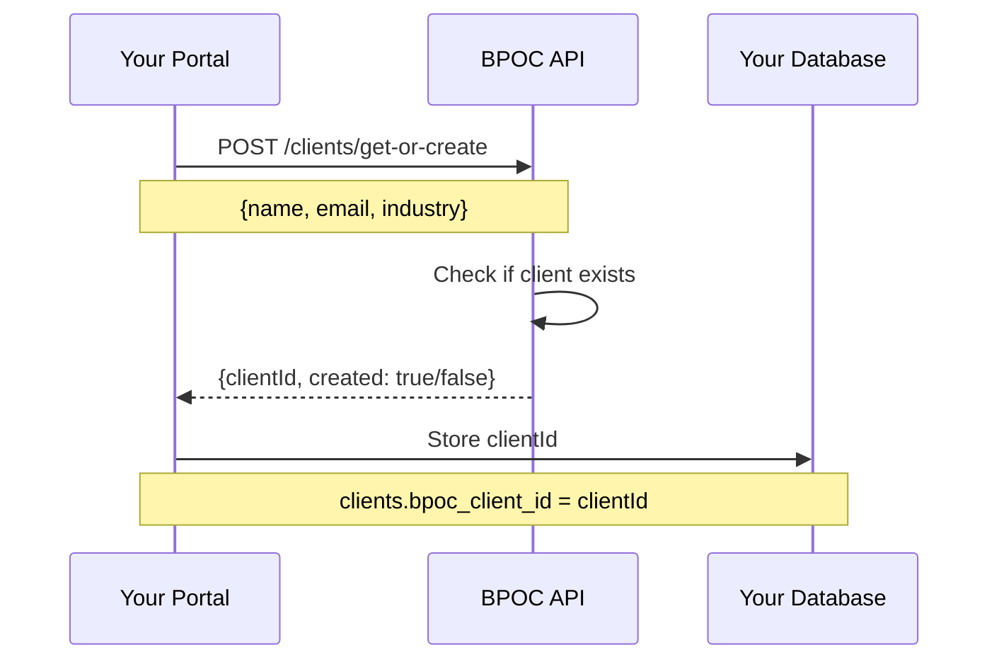
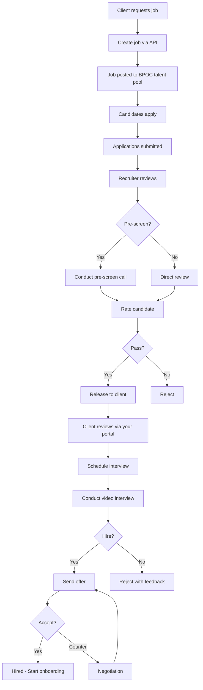
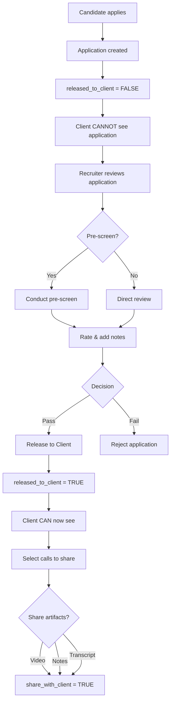
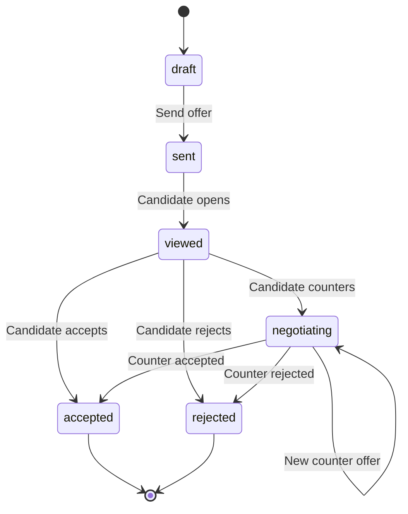

# BPOC API Bible

> **Complete Integration Guide for External Agencies**  
> Version: 2.0 | Generated: January 9, 2026  
> Single Source of Truth for BPOC API Integration

---

## Table of Contents

1. [Introduction](#1-introduction)
2. [Authentication](#2-authentication)
3. [Environments](#3-environments)
4. [Rate Limits & Quotas](#4-rate-limits--quotas)
5. [Complete Workflows](#5-complete-workflows)
6. [API Reference](#6-api-reference)
7. [Data Models](#7-data-models)
8. [Field Values Reference](#8-field-values-reference)
9. [Webhooks](#9-webhooks)
10. [Error Handling](#10-error-handling)
11. [Pagination & Filtering](#11-pagination--filtering)
12. [Code Examples](#12-code-examples)
13. [SDKs & Tools](#13-sdks--tools)
14. [Compliance & Data](#14-compliance--data)
15. [Versioning & Changelog](#15-versioning--changelog)
16. [Support](#16-support)
17. [Appendix A: Quick Reference Card](#appendix-a-quick-reference-card)
18. [Appendix B: Complete Endpoint Index](#appendix-b-complete-endpoint-index)
19. [Appendix C: Database Schema Reference](#appendix-c-database-schema-reference)

---

## 1. Introduction

### 1.1 What is BPOC?

**BPOC (Business Process Outsourcing Connector)** is a comprehensive recruitment platform designed specifically for agencies placing candidates in BPO roles. The platform provides:

- **Talent Pool**: Access to pre-screened, assessed Filipino candidates
- **Complete ATS**: Application tracking from submission to placement
- **Video Infrastructure**: Built-in video interviewing with recording & AI transcription
- **Assessment Tools**: Typing tests, DISC personality, AI resume analysis
- **Multi-Party Access**: Separate portals for Agencies, Clients, and Candidates
- **API-First**: Build your own portals powered by BPOC's infrastructure

### 1.2 Who This Guide Is For

This guide is for software engineers building integrations with BPOC, specifically:

- **Recruitment Agencies** building admin portals to manage multiple clients
- **SaaS Platforms** embedding recruitment functionality for their customers
- **Enterprise Clients** building custom hiring workflows
- **Systems Integrators** connecting BPOC to existing HRIS/ATS systems

### 1.3 Quick Start (5-Minute Integration)

**Step 1:** Get your API key from the Recruiter Portal (`/recruiter/api`)

**Step 2:** Link your first client
```bash
curl -X POST "https://bpoc.io/api/v1/clients/get-or-create" \
  -H "X-API-Key: YOUR_KEY" \
  -H "Content-Type: application/json" \
  -d '{"name": "Acme Corp", "email": "hr@acme.com"}'
```

**Step 3:** Create a job
```bash
curl -X POST "https://bpoc.io/api/v1/jobs/create" \
  -H "X-API-Key: YOUR_KEY" \
  -H "Content-Type: application/json" \
  -d '{
    "clientId": "CLIENT_ID_FROM_STEP_2",
    "title": "Virtual Assistant",
    "description": "Full-time remote VA position",
    "salaryMin": 30000,
    "salaryMax": 45000
  }'
```

**Step 4:** List applications
```bash
curl -X GET "https://bpoc.io/api/v1/applications?mode=recruiter" \
  -H "X-API-Key: YOUR_KEY"
```

### 1.4 Key Concepts

#### Client IDs and Linking

**CRITICAL:** BPOC does NOT auto-create clients. You MUST:

1. Call `POST /clients/get-or-create` with the client's company details
2. Store the returned `clientId` in YOUR database
3. Use that `clientId` for all future operations (jobs, applications, etc.)

If you don't link clients first, you'll get `404 Client not found` errors.

#### Recruiter Gate

The **Recruiter Gate** controls which applications clients can see:

- By default, all applications are `released_to_client = FALSE`
- Recruiters review, pre-screen, and rate candidates
- When ready, recruiters "release" applications to clients
- Only released applications appear in client portals

This ensures quality control before clients see candidates.

#### Tier Restrictions

| Feature | Free | Pro | Enterprise |
|---------|------|-----|------------|
| **View Clients** | ✅ | ✅ | ✅ |
| **View Jobs** | ✅ | ✅ | ✅ |
| **View Applications** | ✅ | ✅ | ✅ |
| **Create Jobs via API** | ❌ | ✅ | ✅ |
| **Interview Management** | ❌ | ✅ | ✅ |
| **Video Calls** | ❌ | ✅ | ✅ |
| **Talent Pool Access** | ❌ | ❌ | ✅ |
| **Offer Management** | ❌ | ❌ | ✅ |
| **AI Transcription** | ❌ | ❌ | ✅ |

---

## 2. Authentication

### 2.1 API Key Generation

1. Log into BPOC as a recruiter (agency owner or admin)
2. Navigate to **API Integration** page (`/recruiter/api`)
3. Click **"Generate API Key"** (owner/admin only)
4. Copy and securely store your key (it won't be shown again)
5. Toggle API access to **"Enabled"**

### 2.2 Request Headers

**All API requests require:**

```
X-API-Key: your-api-key-here
Content-Type: application/json
```

**Example Request:**
```bash
curl -X GET "https://bpoc.io/api/v1/clients" \
  -H "X-API-Key: bpoc_live_xxxxxxxxxxxxxxxxxx" \
  -H "Content-Type: application/json"
```

### 2.3 Security Best Practices

**DO:**
- Store API keys in environment variables (never in code)
- Use HTTPS for all requests (enforced by BPOC)
- Rotate keys periodically
- Use separate keys for development/production (when available)

**DON'T:**
- Commit API keys to version control
- Share keys between projects/clients
- Log full API keys in application logs
- Use keys client-side (keys are for server-to-server only)

---

## 3. Environments

### 3.1 Production

**Base URL:**
```
https://bpoc.io/api/v1
```

**How to get production API key:**
1. Sign up for BPOC at https://bpoc.io
2. Complete agency onboarding
3. Navigate to `/recruiter/api`
4. Generate API key (owner/admin only)

**Production Tier Limits:**
- **Free**: Read-only access
- **Pro**: Full recruitment workflow (₱2,999/month)
- **Enterprise**: Talent pool + AI features (custom pricing)

### 3.2 Sandbox

**Status:** ❌ Not yet available

**Planned Features:**
- Separate sandbox database with test data
- No side effects on production data
- Pre-populated test candidates, jobs, applications
- Reset capability for testing

**Request sandbox access:** Contact support@bpoc.app

---

## 4. Rate Limits & Quotas

### 4.1 Request Limits

**Status:** ❌ Rate limiting not yet implemented

**Planned Limits:**
- **Free tier**: 60 requests/minute
- **Pro tier**: 300 requests/minute
- **Enterprise tier**: 1000 requests/minute or custom

**Current behavior:** No rate limiting (subject to change)

### 4.2 Per-Endpoint Limits

**Status:** ❌ Not yet implemented

### 4.3 Tier-Based Limits

**Status:** ❌ Not yet implemented

### 4.4 Rate Limit Headers

**Planned headers:**
```
X-RateLimit-Limit: 300
X-RateLimit-Remaining: 297
X-RateLimit-Reset: 1672531200
```

### 4.5 Handling Rate Limit Errors

**When rate limits are implemented, expect:**

**Response:**
```json
{
  "error": "Rate limit exceeded",
  "limit": 300,
  "reset": 1672531200
}
```

**Status Code:** `429 Too Many Requests`

**Retry Strategy:**
```typescript
async function retryWithBackoff(fn, maxRetries = 3) {
  for (let i = 0; i < maxRetries; i++) {
    try {
      return await fn();
    } catch (error) {
      if (error.statusCode === 429 && i < maxRetries - 1) {
        const waitTime = Math.min(1000 * Math.pow(2, i), 30000);
        await new Promise(resolve => setTimeout(resolve, waitTime));
      } else {
        throw error;
      }
    }
  }
}
```

---

## 5. Complete Workflows

This section demonstrates complete end-to-end workflows using the BPOC API.

### 5.1 Client Onboarding Flow

**Purpose:** Link a new client to your agency before posting jobs



**Step-by-Step:**

1. **Collect client details** in your portal
2. **Call BPOC API** to link/create client
   ```typescript
   const result = await bpocApi('/clients/get-or-create', {
     method: 'POST',
     body: JSON.stringify({
       name: "Acme Corporation",
       email: "hr@acme.com",
       industry: "Technology",
       contactName: "Jane Doe",
       contactEmail: "jane@acme.com"
     })
   });
   ```
3. **Store `clientId`** in your database
   ```sql
   UPDATE clients 
   SET bpoc_client_id = '...' 
   WHERE id = local_client_id;
   ```
4. **Use `clientId`** for all future job/application operations

---

### 5.2 Job-to-Hire Flow

**Purpose:** Complete recruitment workflow from job posting to placement



**Detailed Steps:**

**Phase 1: Job Creation**
```typescript
// 1. Get clientId (from previous onboarding)
const clientId = await db.clients.findOne({id: localId}).bpoc_client_id;

// 2. Create job
const job = await bpocApi('/jobs/create', {
  method: 'POST',
  body: JSON.stringify({
    clientId,
    title: "Customer Support Specialist",
    description: "Handle customer inquiries via chat and email",
    requirements: ["Excellent English", "2+ years CS experience"],
    responsibilities: ["Answer customer questions", "Resolve issues"],
    benefits: ["HMO", "13th month pay", "Work from home"],
    salaryMin: 30000,
    salaryMax: 45000,
    currency: "PHP",
    workArrangement: "remote",
    workType: "full_time",
    shift: "day",
    experienceLevel: "mid_level"
  })
});

// Job is now live on BPOC platform
```

**Phase 2: Application Review**
```typescript
// 3. List applications (recruiter mode - see ALL applications)
const { applications } = await bpocApi(
  `/applications?clientId=${clientId}&mode=recruiter`
);

// 4. Get full application details
const app = await bpocApi(`/applications/${appId}`);
// Returns: candidate profile, resume, assessments, timeline

// 5. Recruiter review criteria:
// - Does candidate meet requirements?
// - Good resume quality (AI score)?
// - Strong typing speed (WPM)?
// - Right personality type (DISC)?
```

**Phase 3: Pre-Screen (Optional)**
```typescript
// 6. Schedule pre-screen call
const prescreen = await bpocApi('/video/rooms', {
  method: 'POST',
  body: JSON.stringify({
    applicationId: appId,
    callType: 'recruiter_prescreen',
    scheduledFor: '2025-02-10T10:00:00Z'
  })
});

// 7. After call, add rating & notes
await bpocApi(`/applications/${appId}/card/prescreen`, {
  method: 'PATCH',
  body: JSON.stringify({
    rating: 4,
    notes: "Strong communication, good cultural fit",
    outcome: "passed"
  })
});
```

**Phase 4: Release to Client**
```typescript
// 8. Release application to client
await bpocApi(`/applications/${appId}/release`, {
  method: 'POST',
  body: JSON.stringify({
    status: "shortlisted",
    share_calls_with_client: [prescreenRoomId],
    share_calls_with_candidate: []
  })
});

// Application now visible in client portal
```

**Phase 5: Client Interview**
```typescript
// 9. Schedule client interview
const interview = await bpocApi('/interviews', {
  method: 'POST',
  body: JSON.stringify({
    applicationId: appId,
    type: 'client_round_1',
    scheduledAt: '2025-02-15T14:00:00Z',
    clientId: clientId,
    recruiterUserId: recruiterUuid // optional
  })
});

// BPOC creates video room + sends notifications
```

**Phase 6: Offer & Acceptance**
```typescript
// 10. Send offer (Enterprise tier)
const offer = await bpocApi('/offers', {
  method: 'POST',
  body: JSON.stringify({
    applicationId: appId,
    salary: 40000,
    currency: "PHP",
    salaryType: "monthly",
    startDate: "2025-03-01",
    benefits: ["HMO", "13th month", "20 days PTO"]
  })
});

// 11. Candidate accepts/counters/rejects via BPOC platform
// 12. Track offer status
const { offers } = await bpocApi(`/offers?applicationId=${appId}`);
```

---

### 5.3 Video Interview Flow

**Purpose:** End-to-end video interview lifecycle

```mermaid
sequenceDiagram
    participant R as Recruiter
    participant BPOC as BPOC API
    participant Daily as Daily.co
    participant C as Candidate
    participant Client as Client
    
    R->>BPOC: POST /interviews (schedule)
    BPOC->>BPOC: Create interview record
    BPOC->>BPOC: Create video room
    BPOC->>Daily: Create Daily.co room
    Daily-->>BPOC: Room URL + tokens
    BPOC-->>R: {interview, joinUrls}
    
    BPOC->>C: Send notification + join link
    BPOC->>Client: Send notification + join link
    
    Note over C,Client: At scheduled time...
    
    C->>Daily: Click join (tokenized URL)
    Client->>Daily: Click join (tokenized URL)
    R->>Daily: Click join (host token)
    
    Note over C,Client,Daily: Video call in progress
    
    Daily->>Daily: Auto-record call
    Daily->>BPOC: Webhook: recording.ready
    BPOC->>BPOC: Store recording metadata
    
    R->>BPOC: POST /recordings/:id (transcribe)
    BPOC->>BPOC: Download recording
    BPOC->>BPOC: Chunk + transcode (if needed)
    BPOC->>BPOC: OpenAI Whisper API
    BPOC->>BPOC: GPT-4 summary + key points
    BPOC-->>R: Transcript ready
```

**Detailed Steps:**

**1. Schedule Interview**
```typescript
const interview = await bpocApi('/interviews', {
  method: 'POST',
  body: JSON.stringify({
    applicationId: "app-uuid",
    type: "client_round_1",
    scheduledAt: "2025-02-15T10:00:00Z",
    clientId: "client-uuid",
    recruiterUserId: "recruiter-uuid" // optional for client calls
  })
});

// Response includes:
// - interview record
// - video room details
// - recruiterJoinUrl + token
// - candidateJoinUrl + token
// - clientJoinUrl + token (for client calls)
```

**2. Send Join Links**
```typescript
// BPOC automatically sends notifications, but you can also:

// Email to candidate
await sendEmail({
  to: candidate.email,
  subject: "Interview Scheduled",
  body: `Join here: ${interview.candidateJoinUrl}`
});

// Show in client portal
<iframe src={interview.clientJoinUrl} />
```

**3. Join Call**
```typescript
// Daily.co handles the video infrastructure
// Participants click join URLs (tokenized for security)
// No Daily.co account needed for candidates/clients
```

**4. Access Recording**
```typescript
// After call ends, Daily.co processes recording
// BPOC receives webhook and stores metadata

const { recordings } = await bpocApi(
  `/video/recordings?applicationId=${appId}`
);

// Play recording
window.open(recordings[0].playbackUrl);

// Download recording
window.open(recordings[0].downloadUrl);
```

**5. Generate Transcript (Enterprise)**
```typescript
// Trigger AI transcription
await bpocApi(`/video/recordings/${recordingId}`, {
  method: 'POST', // Triggers transcription
});

// Check transcript status
const recording = await bpocApi(`/video/recordings/${recordingId}`);
if (recording.transcriptStatus === 'completed') {
  const transcript = await bpocApi(
    `/video/transcripts/${recording.transcriptId}`
  );
  
  console.log(transcript.fullText);
  console.log(transcript.summary); // AI-generated
  console.log(transcript.keyPoints); // AI-extracted
}
```

---


### 5.5 Interview Availability

#### GET /interviews/availability

Check available time slots for a specific recruiter.

**Endpoint:** `GET /api/v1/interviews/availability`

**Query Parameters:**
- `recruiterId` (Required): UUID of the recruiter.
- `date` (Required): Date in `YYYY-MM-DD` format.

**Response:**
```json
{
  "date": "2026-03-01",
  "timezone": "Asia/Manila",
  "slots": [
    "09:00",
    "09:30",
    "10:00",
    "14:00"
  ]
}
```

### 5.6 Recruiter Gate Flow


**Purpose:** Control which applications clients can see



**Implementation:**

```typescript
// 1. List unreleased applications (recruiter view)
const { applications } = await bpocApi(
  '/applications?mode=recruiter&released=false'
);

// 2. Review application
const app = await bpocApi(`/applications/${appId}`);
// Check: resume, skills, assessments, etc.

// 3. Optional: Pre-screen call
const prescreen = await bpocApi('/video/rooms', {
  method: 'POST',
  body: JSON.stringify({
    applicationId: appId,
    callType: 'recruiter_prescreen'
  })
});

// 4. Release to client
await bpocApi(`/applications/${appId}/release`, {
  method: 'POST',
  body: JSON.stringify({
    status: "shortlisted",
    share_calls_with_client: [
      { room_id: prescreenRoomId, share: true }
    ],
    share_calls_with_candidate: []
  })
});

// 5. Application now visible to client
const { applications: clientApps } = await bpocApi(
  `/applications?clientId=${clientId}&mode=client`
);
// clientApps now includes this application
```

**Sharing Granularity:**

Per-call sharing model (simplified):
- **Per room**: `share_with_client` (boolean)
- **Per room**: `share_with_candidate` (boolean)
- When TRUE: ALL artifacts for that call are shared (video, notes, transcript)

---

### 5.5 Offer & Acceptance Flow

**Purpose:** Complete offer negotiation workflow



**Step-by-Step:**

**1. Create & Send Offer**
```typescript
const offer = await bpocApi('/offers', {
  method: 'POST',
  body: JSON.stringify({
    applicationId: appId,
    salary: 42000,
    currency: "PHP",
    salaryType: "monthly",
    startDate: "2025-03-01",
    benefits: ["HMO", "13th month pay", "20 days PTO"],
    additionalTerms: "Remote work allowed"
  })
});

// Candidate receives notification
```

**2. Candidate Views Offer**
```typescript
// Tracked automatically when candidate opens offer
// offer.viewedAt is set
```

**3. Candidate Submits Counter Offer**
```typescript
// Candidate calls (via their portal):
await bpocApi(`/offers/${offerId}/counter`, {
  method: 'POST',
  body: JSON.stringify({
    requestedSalary: 48000,
    requestedCurrency: "PHP",
    candidateMessage: "Based on my experience, I was hoping for 48k"
  })
});

// offer.status → 'negotiating'
```

**4. Employer Responds**

**Option A: Accept Counter**
```typescript
await bpocApi(`/offers/${offerId}/counter/accept`, {
  method: 'POST',
  body: JSON.stringify({
    counterOfferId: counterOfferId,
    employerMessage: "We accept your counter offer. Welcome aboard!"
  })
});

// offer.status → 'accepted'
// offer.salaryOffered → 48000
// application.status → 'hired'
```

**Option B: Reject Counter (with new offer)**
```typescript
await bpocApi(`/offers/${offerId}/counter/reject`, {
  method: 'POST',
  body: JSON.stringify({
    counterOfferId: counterOfferId,
    employerMessage: "We can meet you at 45k",
    sendNewCounter: true,
    revisedSalary: 45000
  })
});

// Creates new counter offer at 45k
// Ball back in candidate's court
```

**5. Track Offer Status**
```typescript
const { offers } = await bpocApi(`/offers?applicationId=${appId}`);
const currentOffer = offers[0];

console.log(currentOffer.status); // 'negotiating', 'accepted', etc.
console.log(currentOffer.counterOffers); // Array of counter history
```

---

(Continue with API Reference section...)

## 6. API Reference

### 6.1 Clients API

#### GET /clients

List all clients for the agency.

**Endpoint:** `GET /api/v1/clients`

**Authentication:** Required (X-API-Key)

**Tier:** Free+

**Query Parameters:**

| Parameter | Type | Required | Description |
|-----------|------|----------|-------------|
| `status` | string | No | Filter by status: `active`, `inactive`, `all` (default: `active`) |
| `limit` | number | No | Results per page (default: 50, max: 100) |
| `offset` | number | No | Pagination offset (default: 0) |

---

### 6.2 Applications API (Enhanced)

#### POST /applications (Public)

Submit a new application for a candidate (e.g. from an external agency site).

**Endpoint:** `POST /api/v1/applications`

**Authentication:** Required (Agency API Key)

**Request Body:**
```json
{
  "jobId": "uuid",
  "candidate": {
    "email": "candidate@example.com",
    "firstName": "John",
    "lastName": "Doe",
    "resumeUrl": "https://..."
  },
  "source": "api"
}
```

**Response:**
```json
{
  "success": true,
  "message": "Application submitted successfully",
  "applicationId": "uuid"
}
```

---

### 6.3 Offers & E-Sign API

#### POST /offers/:id/sign

Record an e-signature for an offer. This automatically converts the application to "Hired" and generates initial onboarding tasks.

**Endpoint:** `POST /api/v1/offers/:id/sign`

**Request Body:**
```json
{
  "signatureUrl": "https://storage.../signature.png",
  "ipAddress": "203.0.113.1",
  "userAgent": "Mozilla/5.0..."
}
```

**Response:**
```json
{
  "success": true,
  "message": "Offer signed and onboarding started"
}
```

---

### 6.4 Onboarding API

#### GET /onboarding

List onboarding tasks for an application.

**Endpoint:** `GET /api/v1/onboarding`

**Query Parameters:**
- `applicationId` (Required): UUID of the hired application.

**Response:**
```json
{
  "tasks": [
    {
      "id": "uuid",
      "task_type": "document_upload",
      "title": "Upload ID",
      "status": "pending",
      "is_required": true
    }
  ]
}
```

#### POST /onboarding

Create a custom onboarding task.

**Endpoint:** `POST /api/v1/onboarding`

**Request Body:**
```json
{
  "applicationId": "uuid",
  "type": "document_upload",
  "title": "Upload NBI Clearance",
  "description": "Please upload valid clearance",
  "dueDate": "2026-02-01"
}
```

#### PATCH /onboarding/:id

Update a task (Submit / Approve / Reject).

**Endpoint:** `PATCH /api/v1/onboarding/:taskId`

**Request Body (Submission):**
```json
{
  "status": "submitted",
  "attachments": ["https://.../nbi.pdf"]
}
```

**Request Body (Review):**
```json
{
  "status": "approved" // or "rejected"
}
```


**Response:**
```json
{
  "clients": [
    {
      "id": "uuid",
      "companyId": "uuid",
      "name": "Acme Corporation",
      "industry": "Technology",
      "website": "https://acme.com",
      "logoUrl": "https://...",
      "status": "active",
      "contactName": "Jane Doe",
      "contactEmail": "jane@acme.com",
      "contractStart": "2025-01-01",
      "contractEnd": "2026-01-01",
      "createdAt": "2025-01-01T00:00:00Z"
    }
  ],
  "total": 1,
  "note": "Use the 'id' field as clientId when creating jobs via API"
}
```

**Example Request:**
```bash
curl -X GET "https://bpoc.io/api/v1/clients?status=active&limit=10" \
  -H "X-API-Key: YOUR_KEY"
```

**Error Responses:**
- `401 Unauthorized`: Invalid or missing API key
- `403 Forbidden`: Insufficient tier access
- `500 Internal Server Error`: Server error

---

#### POST /clients/get-or-create

Get existing client or create new one for the agency.

**Endpoint:** `POST /api/v1/clients/get-or-create`

**Authentication:** Required (X-API-Key)

**Tier:** Free+

**Request Body:**
```json
{
  "name": "Acme Corporation",       // Required
  "email": "hr@acme.com",           // Optional (used for matching)
  "industry": "Technology",         // Optional
  "website": "https://acme.com",    // Optional
  "contactName": "Jane Doe",        // Optional
  "contactEmail": "jane@acme.com",  // Optional
  "contactPhone": "+63 912 345 6789" // Optional
}
```

**Response:**
```json
{
  "clientId": "b3244902-...",  // ← Store this in your database!
  "companyId": "c8c36c71-...",
  "name": "Acme Corporation",
  "created": false  // true if newly created, false if existing
}
```

**Example Request:**
```bash
curl -X POST "https://bpoc.io/api/v1/clients/get-or-create" \
  -H "X-API-Key: YOUR_KEY" \
  -H "Content-Type: application/json" \
  -d '{
    "name": "Acme Corporation",
    "email": "hr@acme.com",
    "industry": "Technology",
    "contactName": "Jane Doe",
    "contactEmail": "jane@acme.com"
  }'
```

**Critical:** Store the returned `clientId` in your database. You'll need it for all job/application operations.

**Error Responses:**
- `400 Bad Request`: Missing required field `name`
- `401 Unauthorized`: Invalid or missing API key
- `500 Internal Server Error`: Failed to create client

---

### 6.2 Jobs API

#### GET /jobs

List all jobs for the agency.

**Endpoint:** `GET /api/v1/jobs`

**Authentication:** Required (X-API-Key)

**Tier:** Free+

**Query Parameters:**

| Parameter | Type | Required | Description |
|-----------|------|----------|-------------|
| `status` | string | No | Filter by status: `active`, `paused`, `closed`, `filled`, `all` (default: `active`) |
| `clientId` | string | No | Filter by specific client |
| `limit` | number | No | Results per page (default: 50, max: 100) |
| `offset` | number | No | Pagination offset (default: 0) |

**Response:**
```json
{
  "jobs": [
    {
      "id": "uuid",
      "agency_client_id": "uuid",
      "agencyClientId": "uuid",  // camelCase version
      "title": "Customer Support Specialist",
      "slug": "customer-support-specialist-x7k2m9p",
      "description": "Handle customer inquiries...",
      "requirements": ["Excellent English", "2+ years experience"],
      "responsibilities": ["Answer questions", "Resolve issues"],
      "benefits": ["HMO", "13th month pay"],
      "salary_min": 30000,
      "salary_max": 45000,
      "salaryMin": 30000,  // camelCase version
      "salaryMax": 45000,
      "currency": "PHP",
      "salary_type": "monthly",
      "salaryType": "monthly",
      "work_arrangement": "remote",
      "workArrangement": "remote",
      "work_type": "full_time",
      "workType": "full_time",
      "shift": "day",
      "experience_level": "mid_level",
      "experienceLevel": "mid_level",
      "status": "active",
      "priority": "medium",
      "applicants_count": 47,
      "applicantsCount": 47,
      "created_at": "2025-01-01T00:00:00Z",
      "createdAt": "2025-01-01T00:00:00Z"
    }
  ],
  "total": 1,
  "limit": 50,
  "offset": 0
}
```

**Example Request:**
```bash
curl -X GET "https://bpoc.io/api/v1/jobs?status=active&clientId=xxx" \
  -H "X-API-Key: YOUR_KEY"
```

---

#### GET /jobs/:id

Get details for a single job.

**Endpoint:** `GET /api/v1/jobs/:id`

**Authentication:** Required (X-API-Key)

**Tier:** Free+

**Path Parameters:**
- `id` (uuid, required): Job ID

**Response:**
```json
{
  "job": {
    // Same structure as GET /jobs, but single object
    "id": "uuid",
    "title": "Customer Support Specialist",
    // ... all fields
  }
}
```

**Example Request:**
```bash
curl -X GET "https://bpoc.io/api/v1/jobs/job-uuid" \
  -H "X-API-Key: YOUR_KEY"
```

**Error Responses:**
- `404 Not Found`: Job not found or doesn't belong to your agency

---

#### POST /jobs/create

Create a new job listing.

**Endpoint:** `POST /api/v1/jobs/create`

**Authentication:** Required (X-API-Key)

**Tier:** **Pro+** (Creating jobs via API requires Pro plan)

**Request Body:**
```json
{
  "clientId": "uuid",                    // Required (from get-or-create)
  "title": "Customer Support Specialist", // Required
  "description": "Full job description...", // Required
  "requirements": [                      // Optional
    "Excellent English communication",
    "2+ years customer service experience"
  ],
  "responsibilities": [                  // Optional
    "Answer customer inquiries",
    "Resolve issues efficiently"
  ],
  "benefits": [                         // Optional
    "HMO",
    "13th month pay",
    "Work from home"
  ],
  "salaryMin": 30000,                   // Optional
  "salaryMax": 45000,                   // Optional
  "currency": "PHP",                    // Optional (default: PHP)
  "workArrangement": "remote",          // Optional: remote|onsite|hybrid
  "workType": "full_time",              // Optional: full_time|part_time|contract
  "shift": "day",                       // Optional: day|night|flexible
  "experienceLevel": "mid_level",       // Optional: entry_level|mid_level|senior_level
  "skills": ["Communication", "Excel"]  // Optional
}
```

**Flexible Input:** The API normalizes various input formats:
- `"full-time"`, `"fulltime"`, `"full"` → `"full_time"`
- `"mid"`, `"intermediate"` → `"mid_level"`
- `"remote"`, `"wfh"`, `"work from home"` → `"remote"`

**Response:**
```json
{
  "success": true,
  "job": {
    "id": "uuid",
    "title": "Customer Support Specialist",
    "slug": "customer-support-specialist-x7k2m9p",
    "status": "active",
    "createdAt": "2025-01-01T00:00:00Z"
  },
  "message": "Job created successfully"
}
```

**Example Request:**
```bash
curl -X POST "https://bpoc.io/api/v1/jobs/create" \
  -H "X-API-Key: YOUR_KEY" \
  -H "Content-Type: application/json" \
  -d '{
    "clientId": "b3244902-...",
    "title": "Customer Support Specialist",
    "description": "We are looking for...",
    "salaryMin": 30000,
    "salaryMax": 45000,
    "workArrangement": "remote",
    "workType": "full_time"
  }'
```

**Error Responses:**
- `400 Bad Request`: Missing required fields or invalid clientId
- `403 Forbidden`: Pro plan required for job creation via API
- `500 Internal Server Error`: Failed to create job

---

#### PATCH /jobs/:id

Update an existing job.

**Endpoint:** `PATCH /api/v1/jobs/:id`

**Authentication:** Required (X-API-Key)

**Tier:** Pro+

**Path Parameters:**
- `id` (uuid, required): Job ID

**Request Body:** (all fields optional)
```json
{
  "title": "Updated Title",
  "description": "Updated description",
  "status": "paused",        // active|paused|closed|filled
  "salaryMin": 35000,
  "salaryMax": 50000
}
```

**Response:**
```json
{
  "success": true,
  "job": {
    // Updated job object
  }
}
```

**Example Request:**
```bash
curl -X PATCH "https://bpoc.io/api/v1/jobs/job-uuid" \
  -H "X-API-Key: YOUR_KEY" \
  -H "Content-Type: application/json" \
  -d '{"status": "paused"}'
```

---

### 6.3 Applications API

#### GET /applications

List applications for agency's jobs.

**Endpoint:** `GET /api/v1/applications`

**Authentication:** Required (X-API-Key)

**Tier:** Free+

**Query Parameters:**

| Parameter | Type | Required | Description |
|-----------|------|----------|-------------|
| `mode` | string | No | `client` (only released) or `recruiter` (all). Default: `client` |
| `clientId` | string | No | Filter by specific client |
| `jobId` | string | No | Filter by specific job |
| `status` | string | No | Filter by status (see [status values](#application-statuses)) |
| `limit` | number | No | Results per page (default: 50, max: 100) |
| `offset` | number | No | Pagination offset (default: 0) |

**Important:** Use `mode=recruiter` to see ALL applications (including unreleased).

**Response:**
```json
{
  "applications": [
    {
      "id": "uuid",
      "jobId": "uuid",
      "candidateId": "uuid",
      "candidate": {
        "id": "uuid",
        "name": "Maria Santos",
        "email": "maria@example.com",
        "avatarUrl": "https://...",
        "headline": "Experienced VA"
      },
      "jobTitle": "Customer Support Specialist",
      "status": "submitted",
      "releasedToClient": false,
      "releasedAt": null,
      "createdAt": "2025-01-01T00:00:00Z",
      "updatedAt": "2025-01-01T00:00:00Z"
    }
  ],
  "total": 1,
  "limit": 50,
  "offset": 0
}
```

**Example Request:**
```bash
# Recruiter view (see all)
curl -X GET "https://bpoc.io/api/v1/applications?mode=recruiter&status=submitted" \
  -H "X-API-Key: YOUR_KEY"

# Client view (only released)
curl -X GET "https://bpoc.io/api/v1/applications?clientId=xxx" \
  -H "X-API-Key: YOUR_KEY"
```

---

#### GET /applications/:id

Get complete details for a single application.

**Endpoint:** `GET /api/v1/applications/:id`

**Authentication:** Required (X-API-Key)

**Tier:** Free+

**Path Parameters:**
- `id` (uuid, required): Application ID

**Response:**
```json
{
  "application": {
    "id": "uuid",
    "jobId": "uuid",
    "candidateId": "uuid",
    "status": "submitted",
    "releasedToClient": false,
    "candidate": {
      "id": "uuid",
      "firstName": "Maria",
      "lastName": "Santos",
      "email": "maria@example.com",
      "phone": "+63 912 345 6789",
      "avatarUrl": "https://...",
      "headline": "Experienced Virtual Assistant",
      "location": "Manila, Philippines",
      "experienceYears": 5,
      "skills": [
        {
          "name": "Customer Service",
          "proficiency": "expert",
          "years": 5,
          "isPrimary": true
        }
      ],
      "resume": {
        "url": "https://...",
        "uploadedAt": "2024-12-01T00:00:00Z"
      },
      "assessments": {
        "typing": {
          "wpm": 75,
          "accuracy": 98
        },
        "disc": {
          "type": "IC",
          "scores": {...}
        }
      },
      "aiAnalysis": {
        "overallScore": 92,
        "strengths": ["Communication", "Problem-solving"],
        "summary": "Strong candidate with excellent..."
      }
    },
    "job": {
      "id": "uuid",
      "title": "Customer Support Specialist",
      "clientName": "Acme Corp"
    },
    "timeline": [
      {
        "eventType": "applied",
        "description": "Application submitted",
        "timestamp": "2025-01-01T00:00:00Z"
      }
    ],
    "createdAt": "2025-01-01T00:00:00Z",
    "updatedAt": "2025-01-01T00:00:00Z"
  }
}
```

**Example Request:**
```bash
curl -X GET "https://bpoc.io/api/v1/applications/app-uuid" \
  -H "X-API-Key: YOUR_KEY"
```

**Error Responses:**
- `404 Not Found`: Application not found or no access

---

#### PATCH /applications/:id

Update application status.

**Endpoint:** `PATCH /api/v1/applications/:id`

**Authentication:** Required (X-API-Key)

**Tier:** Free+

**Path Parameters:**
- `id` (uuid, required): Application ID

**Request Body:**
```json
{
  "status": "under_review"  // See status values below
}
```

**Valid Status Values:**
- `submitted` → Initial application
- `under_review` → Recruiter reviewing (preferred over `reviewed`)
- `shortlisted` → Passed recruiter gate
- `interview_scheduled` → Interview booked
- `offer_sent` → Offer extended
- `hired` → Candidate hired
- `rejected` → Not selected
- `withdrawn` → Candidate withdrew

**Note:** The API accepts `reviewed` and `review` as aliases for `under_review` for backward compatibility.

**Response:**
```json
{
  "success": true,
  "application": {
    "id": "uuid",
    "status": "under_review",
    "updatedAt": "2025-01-01T00:00:00Z"
  }
}
```

**Example Request:**
```bash
curl -X PATCH "https://bpoc.io/api/v1/applications/app-uuid" \
  -H "X-API-Key: YOUR_KEY" \
  -H "Content-Type: application/json" \
  -d '{"status": "shortlisted"}'
```

---

#### POST /applications/:id/release

Release application to client (Recruiter Gate).

**Endpoint:** `POST /api/v1/applications/:id/release`

**Authentication:** Required (X-API-Key)

**Tier:** Free+

**Path Parameters:**
- `id` (uuid, required): Application ID

**Request Body:**
```json
{
  "status": "shortlisted",                    // Optional: update status
  "share_calls_with_client": ["room-uuid"],   // Array of room IDs to share with client
  "share_calls_with_candidate": []            // Array of room IDs to share with candidate
}
```

**Sharing Format (Flexible):**
```json
// Simple format (array of room IDs)
"share_calls_with_client": ["room-1", "room-2"]

// Or detailed format (array of objects)
"share_calls_with_client": [
  {"room_id": "room-1", "share": true},
  {"room_id": "room-2", "share": false}
]
```

**Response:**
```json
{
  "success": true,
  "application": {
    "id": "uuid",
    "releasedToClient": true,
    "releasedAt": "2025-01-01T00:00:00Z",
    "status": "shortlisted"
  }
}
```

**Example Request:**
```bash
curl -X POST "https://bpoc.io/api/v1/applications/app-uuid/release" \
  -H "X-API-Key: YOUR_KEY" \
  -H "Content-Type: application/json" \
  -d '{
    "status": "shortlisted",
    "share_calls_with_client": ["prescreen-room-uuid"]
  }'
```

**Error Responses:**
- `400 Bad Request`: Invalid room IDs or format
- `404 Not Found`: Application not found
- `500 Internal Server Error`: Database error (check `?debug=1` for details)

---

#### POST /applications/:id/send-back

Hide application from client (send back to recruiter).

**Endpoint:** `POST /api/v1/applications/:id/send-back`

**Authentication:** Required (X-API-Key)

**Tier:** Free+

**Path Parameters:**
- `id` (uuid, required): Application ID

**Request Body:**
```json
{
  "reason": "Needs additional screening"  // Optional
}
```

**Response:**
```json
{
  "success": true,
  "application": {
    "id": "uuid",
    "releasedToClient": false,
    "status": "under_review"
  }
}
```

**Example Request:**
```bash
curl -X POST "https://bpoc.io/api/v1/applications/app-uuid/send-back" \
  -H "X-API-Key: YOUR_KEY" \
  -H "Content-Type: application/json" \
  -d '{"reason": "Client requested more info"}'
```

---

#### POST /applications/invite

Invite a candidate to apply for a job.

**Endpoint:** `POST /api/v1/applications/invite`

**Authentication:** Required (X-API-Key)

**Tier:** Free+

**Request Body:**
```json
{
  "candidateId": "uuid",    // Required
  "jobId": "uuid",          // Required
  "message": "We think you'd be great for this role!"  // Optional
}
```

**Response:**
```json
{
  "success": true,
  "application": {
    "id": "uuid",
    "status": "invited",
    "invitedAt": "2025-01-01T00:00:00Z"
  },
  "notificationCreated": true
}
```

**Example Request:**
```bash
curl -X POST "https://bpoc.io/api/v1/applications/invite" \
  -H "X-API-Key: YOUR_KEY" \
  -H "Content-Type: application/json" \
  -d '{
    "candidateId": "candidate-uuid",
    "jobId": "job-uuid",
    "message": "Great opportunity!"
  }'
```

---

### 6.4 Application Card API (Lifecycle Management)

The Application Card API provides granular control over the complete application lifecycle.

#### GET /applications/:id/card

Get complete application card data (lifecycle view).

**Endpoint:** `GET /api/v1/applications/:id/card`

**Authentication:** Required (X-API-Key)

**Tier:** Free+

**Query Parameters:**

| Parameter | Type | Required | Description |
|-----------|------|----------|-------------|
| `mode` | string | No | `client` or `recruiter` (default: `client`) |

**Response:**
```json
{
  "application": {
    "id": "uuid",
    "status": "shortlisted",
    // ... basic application data
  },
  "candidate": {
    // Complete candidate profile
  },
  "calls": [
    {
      "id": "uuid",
      "callType": "recruiter_prescreen",
      "scheduledAt": "2025-01-15T10:00:00Z",
      "status": "completed",
      "durationSeconds": 1800,
      "rating": 4,
      "notes": "Strong communication skills",
      "shareWithClient": true,
      "shareWithCandidate": false,
      "joinUrl": "https://...",  // If mode=client and shared
      "joinToken": "...",         // If mode=client and shared
      "recordings": [
        {
          "id": "uuid",
          "playbackUrl": "https://...",
          "downloadUrl": "https://...",
          "durationSeconds": 1800
        }
      ],
      "transcripts": [
        {
          "id": "uuid",
          "fullText": "...",
          "summary": "AI-generated summary",
          "keyPoints": ["Point 1", "Point 2"],
          "wordCount": 2500
        }
      ]
    }
  ],
  "interviews": [
    // Scheduled interviews
  ],
  "offers": [
    // Offers (if any)
  ],
  "timeline": [
    // Activity timeline
  ]
}
```

**Example Request:**
```bash
# Client mode (filtered view)
curl -X GET "https://bpoc.io/api/v1/applications/app-uuid/card?mode=client" \
  -H "X-API-Key: YOUR_KEY"

# Recruiter mode (full view)
curl -X GET "https://bpoc.io/api/v1/applications/app-uuid/card?mode=recruiter" \
  -H "X-API-Key: YOUR_KEY"
```

---

#### PATCH /applications/:id/card/client-feedback

Update client feedback for an application.

**Endpoint:** `PATCH /api/v1/applications/:id/card/client-feedback`

**Authentication:** Required (X-API-Key)

**Tier:** Free+

**Request Body:**
```json
{
  "notes": "Great candidate, strong technical skills",
  "rating": 4  // 1-5 stars
}
```

**Note:** Tags have been removed. Only notes and rating are supported.

**Response:**
```json
{
  "success": true,
  "feedback": {
    "applicationId": "uuid",
    "notes": "Great candidate...",
    "rating": 4,
    "updatedAt": "2025-01-01T00:00:00Z"
  }
}
```

**Example Request:**
```bash
curl -X PATCH "https://bpoc.io/api/v1/applications/app-uuid/card/client-feedback" \
  -H "X-API-Key: YOUR_KEY" \
  -H "Content-Type: application/json" \
  -d '{"notes": "Excellent fit", "rating": 5}'
```

---

### 6.5 Interviews API

#### GET /interviews

List interviews for agency.

**Endpoint:** `GET /api/v1/interviews`

**Authentication:** Required (X-API-Key)

**Tier:** Pro+

**Query Parameters:**

| Parameter | Type | Required | Description |
|-----------|------|----------|-------------|
| `clientId` | string | No | Filter by client |
| `status` | string | No | Filter by status: `scheduled`, `completed`, `cancelled`, etc. |
| `limit` | number | No | Results per page (default: 50, max: 100) |
| `offset` | number | No | Pagination offset |

**Response:**
```json
{
  "interviews": [
    {
      "id": "uuid",
      "applicationId": "uuid",
      "interviewType": "client_round_1",
      "scheduledAt": "2025-02-15T10:00:00Z",
      "durationMinutes": 60,
      "status": "scheduled",
      "candidate": {
        "name": "Maria Santos"
      },
      "job": {
        "title": "Customer Support Specialist"
      },
      "videoRoomId": "uuid",
      "recruiterJoinUrl": "https://...",
      "candidateJoinUrl": "https://...",
      "clientJoinUrl": "https://...",
      "createdAt": "2025-01-01T00:00:00Z"
    }
  ],
  "total": 1
}
```

**Example Request:**
```bash
curl -X GET "https://bpoc.io/api/v1/interviews?status=scheduled" \
  -H "X-API-Key: YOUR_KEY"
```

---

#### POST /interviews

Schedule a new interview.

**Endpoint:** `POST /api/v1/interviews`

**Authentication:** Required (X-API-Key)

**Tier:** Pro+

**Request Body:**
```json
{
  "applicationId": "uuid",              // Required
  "type": "client_round_1",             // Required (see interview types)
  "scheduledAt": "2025-02-15T10:00:00Z", // Required (ISO 8601, UTC)
  "durationMinutes": 60,                // Optional (default: 60)
  "clientId": "uuid",                   // Required for client_* types
  "recruiterUserId": "uuid"             // Optional (defaults to API key owner)
}
```

**Interview Types:**
- `recruiter_prescreen` - Initial screening by recruiter
- `recruiter_round_1` - Recruiter deep-dive
- `client_round_1` - First client interview
- `client_round_2` - Second client interview
- `client_final` - Final client interview

**Response:**
```json
{
  "success": true,
  "interview": {
    "id": "uuid",
    "applicationId": "uuid",
    "interviewType": "client_round_1",
    "scheduledAt": "2025-02-15T10:00:00Z",
    "status": "scheduled",
    "videoRoomId": "uuid"
  },
  "room": {
    "id": "uuid",
    "roomName": "agency-interview-...",
    "roomUrl": "https://..."
  },
  "joinUrls": {
    "recruiter": {
      "url": "https://...?t=RECRUITER_TOKEN",
      "token": "RECRUITER_TOKEN"
    },
    "candidate": {
      "url": "https://...?t=CANDIDATE_TOKEN",
      "token": "CANDIDATE_TOKEN"
    },
    "client": {
      "url": "https://...?t=CLIENT_TOKEN",
      "token": "CLIENT_TOKEN"
    }
  }
}
```

**Example Request:**
```bash
curl -X POST "https://bpoc.io/api/v1/interviews" \
  -H "X-API-Key: YOUR_KEY" \
  -H "Content-Type: application/json" \
  -d '{
    "applicationId": "app-uuid",
    "type": "client_round_1",
    "scheduledAt": "2025-02-15T10:00:00Z",
    "clientId": "client-uuid"
  }'
```

---

### 6.6 Offers API (Enterprise)

#### GET /offers

List job offers.

**Endpoint:** `GET /api/v1/offers`

**Authentication:** Required (X-API-Key)

**Tier:** **Enterprise**

**Query Parameters:**

| Parameter | Type | Required | Description |
|-----------|------|----------|-------------|
| `clientId` | string | No | Filter by client |
| `status` | string | No | Filter by status |
| `limit` | number | No | Results per page (default: 50) |
| `offset` | number | No | Pagination offset |

**Response:**
```json
{
  "offers": [
    {
      "id": "uuid",
      "applicationId": "uuid",
      "salary_offered": 42000,      // Snake case (DB field)
      "salaryOffered": 42000,       // Camel case (convenience)
      "currency": "PHP",
      "salaryType": "monthly",
      "startDate": "2025-03-01",
      "benefitsOffered": ["HMO", "13th month"],
      "additionalTerms": "Remote work allowed",
      "status": "sent",
      "sentAt": "2025-01-15T00:00:00Z",
      "viewedAt": null,
      "expiresAt": "2025-01-30T00:00:00Z",
      "candidate": {
        "name": "Maria Santos",
        "email": "maria@example.com"
      },
      "job": {
        "title": "Customer Support Specialist"
      }
    }
  ],
  "total": 1
}
```

**Example Request:**
```bash
curl -X GET "https://bpoc.io/api/v1/offers?status=sent" \
  -H "X-API-Key: YOUR_KEY"
```

---

#### POST /offers

Create and send a job offer.

**Endpoint:** `POST /api/v1/offers`

**Authentication:** Required (X-API-Key)

**Tier:** **Enterprise**

**Request Body:**
```json
{
  "applicationId": "uuid",          // Required
  "salary": 42000,                  // Required (use 'salary' in request)
  "currency": "PHP",                // Optional (default: PHP)
  "salaryType": "monthly",          // Optional: monthly|yearly|hourly
  "startDate": "2025-03-01",        // Optional
  "benefits": ["HMO", "13th month"], // Optional
  "additionalTerms": "Remote work"  // Optional
}
```

**Response:**
```json
{
  "success": true,
  "offer": {
    "id": "uuid",
    "applicationId": "uuid",
    "salary_offered": 42000,  // Stored as salary_offered
    "salaryOffered": 42000,   // Camel case version
    "status": "sent",
    "sentAt": "2025-01-01T00:00:00Z",
    "expiresAt": "2025-01-15T23:59:59Z"
  }
}
```

**Example Request:**
```bash
curl -X POST "https://bpoc.io/api/v1/offers" \
  -H "X-API-Key: YOUR_KEY" \
  -H "Content-Type: application/json" \
  -d '{
    "applicationId": "app-uuid",
    "salary": 42000,
    "currency": "PHP",
    "salaryType": "monthly",
    "startDate": "2025-03-01",
    "benefits": ["HMO", "13th month pay"]
  }'
```

---

### 6.7 Counter Offers API (Enterprise)

#### GET /offers/:offerId/counter

Get counter offer history.

**Endpoint:** `GET /api/v1/offers/:offerId/counter`

**Authentication:** Required (X-API-Key)

**Tier:** **Enterprise**

**Response:**
```json
{
  "counterOffers": [
    {
      "id": "uuid",
      "offerId": "uuid",
      "requestedSalary": 48000,
      "requestedCurrency": "PHP",
      "candidateMessage": "Based on my experience...",
      "status": "pending",
      "createdAt": "2025-01-16T00:00:00Z"
    }
  ]
}
```

---

#### POST /offers/:offerId/counter/accept

Accept a candidate's counter offer.

**Endpoint:** `POST /api/v1/offers/:offerId/counter/accept`

**Authentication:** Required (X-API-Key)

**Tier:** **Enterprise**

**Request Body:**
```json
{
  "counterOfferId": "uuid",  // Optional if only one pending
  "employerMessage": "We accept your counter offer!"
}
```

**Response:**
```json
{
  "success": true,
  "offer": {
    "id": "uuid",
    "salary_offered": 48000,  // Updated to counter amount
    "salaryOffered": 48000,
    "status": "accepted"
  },
  "application": {
    "id": "uuid",
    "status": "hired"
  }
}
```

---

#### POST /offers/:offerId/counter/reject

Reject a counter offer (optionally send new counter).

**Endpoint:** `POST /api/v1/offers/:offerId/counter/reject`

**Authentication:** Required (X-API-Key)

**Tier:** **Enterprise**

**Request Body:**
```json
{
  "counterOfferId": "uuid",
  "employerMessage": "We can meet at 45k",
  "sendNewCounter": true,      // Optional
  "revisedSalary": 45000       // Required if sendNewCounter=true
}
```

**Response:**
```json
{
  "success": true,
  "message": "Counter offer sent to candidate",
  "counterOffer": {
    "id": "uuid",
    "requestedSalary": 45000,
    "status": "pending"
  }
}
```

---

### 6.8 Video Rooms API (Pro+)

#### GET /video/rooms

List video call rooms.

**Endpoint:** `GET /api/v1/video/rooms`

**Authentication:** Required (X-API-Key)

**Tier:** Pro+

**Query Parameters:**

| Parameter | Type | Required | Description |
|-----------|------|----------|-------------|
| `applicationId` | string | No | Filter by application |
| `interviewId` | string | No | Filter by interview |
| `clientId` | string | No | Filter by client |
| `status` | string | No | Filter by status |

**Response:**
```json
{
  "rooms": [
    {
      "id": "uuid",
      "roomName": "agency-interview-...",
      "roomUrl": "https://...",
      "applicationId": "uuid",
      "interviewId": "uuid",
      "callType": "client_round_1",
      "status": "scheduled",
      "scheduledFor": "2025-02-15T10:00:00Z",
      "shareWithClient": true,
      "shareWithCandidate": false
    }
  ]
}
```

---

#### POST /video/rooms

Create a video call room.

**Endpoint:** `POST /api/v1/video/rooms`

**Authentication:** Required (X-API-Key)

**Tier:** Pro+

**Request Body:**
```json
{
  "applicationId": "uuid",              // Required
  "callType": "client_round_1",         // Required
  "interviewId": "uuid",                // Optional (links to interview)
  "scheduledFor": "2025-02-15T10:00:00Z", // Optional
  "clientId": "uuid",                   // Required for client_* types
  "recruiterUserId": "uuid"             // Optional
}
```

**Response:**
```json
{
  "success": true,
  "room": {
    "id": "uuid",
    "roomName": "agency-interview-...",
    "roomUrl": "https://...",
    "status": "scheduled",
    "expiresAt": "2025-02-22T10:00:00Z"
  },
  "host": {
    "joinUrl": "https://...?t=HOST_TOKEN",
    "token": "HOST_TOKEN"
  },
  "participant": {
    "joinUrl": "https://...?t=PARTICIPANT_TOKEN",
    "token": "PARTICIPANT_TOKEN"
  },
  "client": {
    "joinUrl": "https://...?t=CLIENT_TOKEN",
    "token": "CLIENT_TOKEN"
  }
}
```

---

### 6.9 Candidates API (Talent Pool - Enterprise)

#### GET /candidates

Search talent pool.

**Endpoint:** `GET /api/v1/candidates`

**Authentication:** Required (X-API-Key)

**Tier:** **Enterprise**

**Query Parameters:**

| Parameter | Type | Required | Description |
|-----------|------|----------|-------------|
| `search` | string | No | Search name, email, keywords |
| `skills` | string | No | Comma-separated skills |
| `hasResume` | boolean | No | Filter candidates with resumes |
| `limit` | number | No | Results per page (default: 50) |
| `offset` | number | No | Pagination offset |

**Response:**
```json
{
  "candidates": [
    {
      "id": "uuid",
      "firstName": "Maria",
      "lastName": "Santos",
      "email": "maria@example.com",
      "headline": "Experienced Virtual Assistant",
      "location": "Manila, Philippines",
      "experienceYears": 5,
      "skills": ["Communication", "Excel", "Customer Service"],
      "hasResume": true,
      "assessments": {
        "typing": {
          "wpm": 75,
          "accuracy": 98
        },
        "disc": "IC"
      },
      "aiScore": 92
    }
  ],
  "total": 150
}
```

---

#### GET /candidates/:id/complete

Get complete candidate profile (Candidate Truth API).

**Endpoint:** `GET /api/v1/candidates/:id/complete`

**Authentication:** Required (X-API-Key)

**Tier:** **Enterprise** (for talent pool), Pro+ (for own applicants)

**Response:**
```json
{
  "candidate": {
    "id": "uuid",
    "firstName": "Maria",
    "lastName": "Santos",
    "fullName": "Maria Santos",
    "email": "maria@example.com",
    "phone": "+63 912 345 6789",
    "avatarUrl": "https://...",
    "headline": "Experienced Virtual Assistant",
    "bio": "5+ years of experience...",
    "location": "Manila, Philippines",
    "experienceYears": 5,
    "skills": [
      {
        "name": "Customer Service",
        "proficiency": "expert",
        "years": 5,
        "isPrimary": true
      }
    ],
    "workExperiences": [
      {
        "role": "Virtual Assistant",
        "company": "Acme Corp",
        "startDate": "2020-01-01",
        "endDate": null,
        "isCurrent": true,
        "description": "..."
      }
    ],
    "educations": [
      {
        "degree": "Bachelor of Science",
        "institution": "University of the Philippines",
        "field": "Business Administration",
        "year": 2019
      }
    ],
    "assessments": {
      "typing": {
        "wpm": 75,
        "accuracy": 98,
        "completedAt": "2024-12-01T00:00:00Z"
      },
      "disc": {
        "type": "IC",
        "scores": {
          "dominance": 30,
          "influence": 80,
          "steadiness": 40,
          "conscientiousness": 70
        },
        "completedAt": "2024-12-01T00:00:00Z"
      }
    },
    "resume": {
      "url": "https://...",
      "uploadedAt": "2024-12-01T00:00:00Z"
    },
    "aiAnalysis": {
      "overallScore": 92,
      "strengths": ["Communication", "Problem-solving", "Time management"],
      "summary": "Strong candidate with excellent communication skills...",
      "analyzedAt": "2024-12-01T00:00:00Z"
    },
    "profileCompletionPercentage": 95
  }
}
```

---

## 7. Data Models

This section documents the complete data structures returned by the API.

### 7.1 Client Object

```typescript
interface Client {
  // IDs
  id: string;                  // agency_clients.id (use as clientId)
  companyId: string;           // companies.id
  agencyId: string;            // agency_id
  
  // Company Details
  name: string;
  industry: string | null;
  website: string | null;
  logoUrl: string | null;
  description: string | null;
  
  // Contact
  contactName: string | null;
  contactEmail: string | null;
  contactPhone: string | null;
  
  // Status
  status: 'active' | 'inactive';
  
  // Contract
  contractStart: string | null;  // ISO 8601 date
  contractEnd: string | null;
  
  // Computed Stats
  jobCount?: number;
  activeJobCount?: number;
  totalApplications?: number;
  placementCount?: number;
  lastContactAt?: string;
  
  // Timestamps
  createdAt: string;  // ISO 8601
  updatedAt: string;
}
```

---

### 7.2 Job Object

```typescript
interface Job {
  // IDs
  id: string;
  agency_client_id: string;
  agencyClientId: string;      // Camel case version
  postedBy: string | null;     // Recruiter user ID
  
  // Basic Info
  title: string;
  slug: string;
  description: string;
  
  // Details (JSONB arrays)
  requirements: string[];
  responsibilities: string[];
  benefits: string[];
  
  // Salary
  salary_min: number | null;
  salary_max: number | null;
  salaryMin: number | null;    // Camel case
  salaryMax: number | null;
  currency: string;            // Default: 'PHP'
  salary_type: 'hourly' | 'monthly' | 'yearly' | null;
  salaryType: string | null;
  
  // Work Details
  work_arrangement: 'remote' | 'onsite' | 'hybrid' | null;
  workArrangement: string | null;
  work_type: 'full_time' | 'part_time' | 'contract' | null;
  workType: string | null;
  shift: 'day' | 'night' | 'flexible' | null;
  experience_level: 'entry_level' | 'mid_level' | 'senior_level' | null;
  experienceLevel: string | null;
  
  // Classification
  industry: string | null;
  department: string | null;
  
  // Status
  status: 'draft' | 'active' | 'paused' | 'closed' | 'filled';
  priority: 'low' | 'medium' | 'high' | 'urgent' | null;
  
  // Dates
  application_deadline: string | null;  // ISO 8601 date
  applicationDeadline: string | null;
  
  // Stats
  views: number;
  applicants_count: number;
  applicantsCount: number;
  
  // Timestamps
  created_at: string;  // ISO 8601
  updated_at: string;
  createdAt: string;   // Camel case
  updatedAt: string;
}
```

---

### 7.3 Application Object

```typescript
interface Application {
  // IDs
  id: string;
  jobId: string;
  candidateId: string;
  
  // Status
  status: ApplicationStatus;  // See enum below
  
  // Recruiter Gate
  releasedToClient: boolean;
  releasedAt: string | null;  // ISO 8601
  releasedBy: string | null;  // Recruiter user ID
  
  // Review
  reviewedBy: string | null;
  reviewedAt: string | null;
  
  // Rejection
  rejectedBy: 'recruiter' | 'client' | null;
  rejectionReason: string | null;
  rejectedAt: string | null;
  
  // Hired
  hiredAt: string | null;
  startedStatus: 'started' | 'no_show' | null;
  firstDayDate: string | null;  // ISO 8601 date
  
  // Timestamps
  createdAt: string;
  updatedAt: string;
  appliedAt: string;
  
  // Related Objects (when expanded)
  candidate?: Candidate;
  job?: Job;
  calls?: VideoCallRoom[];
  interviews?: Interview[];
  offers?: Offer[];
  timeline?: TimelineEvent[];
}

type ApplicationStatus =
  | 'invited'
  | 'submitted'
  | 'under_review'
  | 'shortlisted'
  | 'interview_scheduled'
  | 'offer_pending'
  | 'offer_sent'
  | 'offer_accepted'
  | 'hired'
  | 'rejected'
  | 'withdrawn';
```

---

### 7.4 Candidate Object

```typescript
interface Candidate {
  // Basic Info
  id: string;
  firstName: string;
  lastName: string;
  fullName: string;
  email: string;
  phone: string | null;
  avatarUrl: string | null;
  username: string | null;
  slug: string | null;
  
  // Profile
  headline: string | null;
  bio: string | null;
  position: string | null;
  
  // Location
  location: string | null;
  locationCity: string | null;
  locationProvince: string | null;
  locationCountry: string | null;
  locationRegion: string | null;
  
  // Professional
  experienceYears: number;
  currentRole: string | null;
  currentCompany: string | null;
  workStatus: 'available' | 'employed' | 'not_looking' | null;
  expectedSalaryMin: number | null;
  expectedSalaryMax: number | null;
  noticePeriodDays: number | null;
  preferredShift: 'day' | 'night' | 'flexible' | null;
  preferredWorkSetup: 'remote' | 'onsite' | 'hybrid' | null;
  
  // Skills
  skills: Skill[];
  
  // Work History
  workExperiences: WorkExperience[];
  
  // Education
  educations: Education[];
  
  // Assessments
  assessments: {
    typing: TypingAssessment | null;
    disc: DISCAssessment | null;
  };
  
  // Resume
  resume: Resume | null;
  
  // AI Analysis
  aiAnalysis: AIAnalysis | null;
  
  // Profile Status
  profileCompleted: boolean;
  profileCompletionPercentage: number;
  isActive: boolean;
  
  // Timestamps
  createdAt: string;
  updatedAt: string;
  lastActive: string | null;
}

interface Skill {
  name: string;
  proficiency: 'beginner' | 'intermediate' | 'advanced' | 'expert';
  years: number | null;
  isPrimary: boolean;
}

interface WorkExperience {
  role: string;
  company: string;
  startDate: string;  // ISO 8601 date
  endDate: string | null;
  isCurrent: boolean;
  description: string | null;
}

interface Education {
  degree: string;
  institution: string;
  field: string | null;
  year: number | null;
}

interface TypingAssessment {
  wpm: number;
  accuracy: number;
  completedAt: string;
}

interface DISCAssessment {
  type: string;  // e.g., 'IC', 'DS'
  scores: {
    dominance: number;
    influence: number;
    steadiness: number;
    conscientiousness: number;
  };
  completedAt: string;
}

interface Resume {
  url: string;
  uploadedAt: string;
}

interface AIAnalysis {
  overallScore: number;  // 0-100
  strengths: string[];
  summary: string;
  analyzedAt: string;
}
```

---

### 7.5 Interview Object

```typescript
interface Interview {
  // IDs
  id: string;
  applicationId: string;
  
  // Type
  interviewType: InterviewType;
  
  // Scheduling
  scheduledAt: string;  // ISO 8601, UTC
  durationMinutes: number;
  
  // Timezone Display
  clientTimezone: string | null;
  scheduledAtClientLocal: string | null;
  scheduledAtPH: string | null;
  
  // Location
  location: string | null;
  meetingLink: string | null;
  videoRoomId: string | null;
  
  // Participants
  interviewerId: string | null;
  interviewerName: string | null;
  
  // Status
  status: 'scheduled' | 'confirmed' | 'in_progress' | 'completed' | 'cancelled' | 'no_show' | 'rescheduled';
  
  // Outcome (after completion)
  outcome: 'passed' | 'failed' | 'pending_decision' | 'needs_followup' | null;
  rating: number | null;  // 1-5
  feedback: any | null;  // JSONB
  notes: string | null;
  
  // Timing
  startedAt: string | null;
  endedAt: string | null;
  
  // Timestamps
  createdAt: string;
  updatedAt: string;
}

type InterviewType =
  | 'recruiter_prescreen'
  | 'recruiter_round_1'
  | 'recruiter_round_2'
  | 'client_round_1'
  | 'client_round_2'
  | 'client_final';
```

---

### 7.6 Offer Object

```typescript
interface Offer {
  // IDs
  id: string;
  applicationId: string;
  
  // Compensation
  salary_offered: number;      // Snake case (DB field)
  salaryOffered: number;       // Camel case (convenience)
  currency: string;            // Default: 'PHP'
  salary_type: 'hourly' | 'monthly' | 'yearly';
  salaryType: string;          // Camel case
  
  // Terms
  start_date: string | null;   // ISO 8601 date
  startDate: string | null;
  benefits_offered: string[];  // JSONB array
  benefitsOffered: string[];
  additional_terms: string | null;
  additionalTerms: string | null;
  
  // Status
  status: OfferStatus;
  
  // Tracking
  sent_at: string | null;
  sentAt: string | null;
  viewed_at: string | null;
  viewedAt: string | null;
  responded_at: string | null;
  respondedAt: string | null;
  expires_at: string | null;
  expiresAt: string | null;
  
  // Response
  candidate_response: string | null;
  candidateResponse: string | null;
  rejection_reason: string | null;
  rejectionReason: string | null;
  
  // Related
  candidate?: {
    name: string;
    email: string;
  };
  job?: {
    title: string;
  };
  counterOffers?: CounterOffer[];
  
  // Metadata
  created_by: string | null;
  createdBy: string | null;
  created_at: string;
  createdAt: string;
}

type OfferStatus =
  | 'draft'
  | 'sent'
  | 'viewed'
  | 'accepted'
  | 'declined'
  | 'negotiating'
  | 'expired'
  | 'withdrawn';

interface CounterOffer {
  id: string;
  offerId: string;
  requestedSalary: number;
  requestedCurrency: string;
  candidateMessage: string | null;
  status: 'pending' | 'accepted' | 'rejected';
  createdAt: string;
  respondedAt: string | null;
}
```

---

### 7.7 Video Call Room Object

```typescript
interface VideoCallRoom {
  // IDs
  id: string;
  applicationId: string | null;
  interviewId: string | null;
  agencyId: string;
  
  // Daily.co Details
  dailyRoomName: string;
  roomUrl: string;
  
  // Call Type
  callType: CallType;
  
  // Participants
  hostUserId: string | null;      // Can be recruiter or agency_id
  participantUserId: string | null; // Candidate
  
  // Scheduling
  scheduledFor: string | null;  // ISO 8601
  
  // Status
  status: 'scheduled' | 'active' | 'ended' | 'cancelled';
  
  // Sharing (Per-Call Model)
  shareWithClient: boolean;      // When true, ALL artifacts shared with client
  shareWithCandidate: boolean;   // When true, ALL artifacts shared with candidate
  
  // Timing
  startedAt: string | null;
  endedAt: string | null;
  durationSeconds: number | null;
  
  // Expiration
  expiresAt: string;
  
  // Metadata
  createdAt: string;
  updatedAt: string;
  
  // Related (when expanded)
  recordings?: Recording[];
  transcripts?: Transcript[];
  participants?: Participant[];
}

type CallType =
  | 'recruiter_prescreen'
  | 'recruiter_round_1'
  | 'recruiter_round_2'
  | 'recruiter_round_3'
  | 'recruiter_offer_call'
  | 'recruiter_general'
  | 'client_prescreen'
  | 'client_round_1'
  | 'client_round_2'
  | 'client_round_3'
  | 'client_final'
  | 'client_general';
```

---

### 7.8 Recording Object

```typescript
interface Recording {
  id: string;
  roomId: string;
  applicationId: string | null;
  
  // Daily.co Details
  dailyRecordingId: string;
  recordingUrl: string | null;  // Daily.co access URL
  playbackUrl: string | null;   // Public playback
  downloadUrl: string | null;   // Download link
  
  // Duration
  durationSeconds: number | null;
  
  // Status
  status: 'processing' | 'ready' | 'failed';
  
  // Sharing (mirrors room settings)
  sharedWithClient: boolean;
  sharedWithCandidate: boolean;
  
  // Transcript Link
  transcriptId: string | null;
  transcriptStatus: 'pending' | 'processing' | 'completed' | 'failed' | null;
  
  // Context (when expanded)
  candidate?: {
    name: string;
  };
  job?: {
    title: string;
  };
  
  // Timestamps
  recordedAt: string;
  createdAt: string;
}
```

---

### 7.9 Transcript Object

```typescript
interface Transcript {
  id: string;
  roomId: string;
  recordingId: string | null;
  
  // Content
  fullText: string;
  summary: string | null;      // AI-generated summary
  keyPoints: string[] | null;  // AI-extracted key points
  wordCount: number | null;
  
  // Sharing (mirrors room settings)
  sharedWithClient: boolean;
  sharedWithCandidate: boolean;
  
  // Status
  status: 'processing' | 'completed' | 'failed';
  
  // Timestamps
  createdAt: string;
  updatedAt: string;
}
```

---

### 7.10 Timeline Event Object

```typescript
interface TimelineEvent {
  id: string;
  applicationId: string;
  
  // Event Details
  actionType: string;  // See event types below
  description: string;
  
  // Actor
  performedByType: 'system' | 'candidate' | 'recruiter' | 'client';
  performedById: string | null;
  
  // Metadata (JSONB - varies by event)
  metadata: any | null;
  
  // Timestamp
  createdAt: string;
}

// Common Action Types
type ActionType =
  | 'applied'
  | 'status_changed'
  | 'released_to_client'
  | 'sent_back_to_recruiter'
  | 'rejected'
  | 'hired'
  | 'started'
  | 'no_show'
  | 'prescreen_scheduled'
  | 'prescreen_completed'
  | 'interview_scheduled'
  | 'interview_completed'
  | 'offer_sent'
  | 'offer_accepted'
  | 'offer_declined'
  | 'counter_submitted'
  | 'withdrawn';
```

---

## 8. Field Values Reference

This section documents all valid values for enum fields and status transitions.

### 8.1 Status Values

#### Application Statuses

| Status | Description | Next Possible States |
|--------|-------------|---------------------|
| `invited` | Candidate invited by recruiter | `submitted`, `withdrawn` |
| `submitted` | Application received | `under_review`, `rejected` |
| `under_review` | Recruiter actively reviewing | `shortlisted`, `rejected` |
| `shortlisted` | Passed recruiter gate, visible to client | `interview_scheduled`, `rejected` |
| `interview_scheduled` | Interview booked | `offer_sent`, `rejected` |
| `offer_pending` | Preparing offer | `offer_sent`, `rejected` |
| `offer_sent` | Offer extended | `offer_accepted`, `rejected`, `withdrawn` |
| `offer_accepted` | Candidate accepted | `hired` |
| `hired` | Candidate hired, onboarding | `started`, `no_show` |
| `started` | Day 1 completed (success!) | *(terminal)* |
| `rejected` | Not selected | *(terminal)* |
| `withdrawn` | Candidate withdrew | *(terminal)* |

**Aliases (backward compatibility):**
- `reviewed` → Maps to `under_review`
- `review` → Maps to `under_review`

---

#### Job Statuses

| Status | Description | Actions Available |
|--------|-------------|-------------------|
| `draft` | Job being prepared | Publish, Edit, Delete |
| `active` | Live, accepting applications | Pause, Close, Fill, Edit |
| `paused` | Temporarily hidden | Resume, Close, Edit |
| `closed` | No longer accepting applications | Archive |
| `filled` | Position filled | Archive |

---

#### Interview Statuses

| Status | Description |
|--------|-------------|
| `scheduled` | Interview booked |
| `confirmed` | Both parties confirmed |
| `in_progress` | Interview happening now |
| `completed` | Interview finished |
| `cancelled` | Interview cancelled |
| `no_show` | Candidate didn't attend |
| `rescheduled` | Moved to new time |

---

#### Offer Statuses

| Status | Description |
|--------|-------------|
| `draft` | Offer being prepared |
| `sent` | Offer sent to candidate |
| `viewed` | Candidate opened offer |
| `accepted` | Candidate accepted |
| `declined` | Candidate rejected |
| `negotiating` | Counter offer in progress |
| `expired` | Offer expired before response |
| `withdrawn` | Employer withdrew offer |

---

#### Video Room Statuses

| Status | Description |
|--------|-------------|
| `scheduled` | Room created, not yet started |
| `active` | Call in progress |
| `ended` | Call completed |
| `cancelled` | Call cancelled |

---

#### Recording Statuses

| Status | Description |
|--------|-------------|
| `processing` | Daily.co processing recording |
| `ready` | Recording available |
| `failed` | Processing failed |

---

#### Transcript Statuses

| Status | Description |
|--------|-------------|
| `pending` | Waiting to start |
| `processing` | Transcribing audio |
| `completed` | Transcript ready |
| `failed` | Transcription failed |

---

### 8.2 Enum Values

#### Work Arrangement

| API Value | Description | Aliases Accepted |
|-----------|-------------|------------------|
| `remote` | Work from home | `wfh`, `work_from_home` |
| `onsite` | Office-based | `on_site`, `office` |
| `hybrid` | Mix of remote/onsite | `mixed` |

---

#### Work Type

| API Value | Description | Aliases Accepted |
|-----------|-------------|------------------|
| `full_time` | Full-time employment | `fulltime`, `full` |
| `part_time` | Part-time employment | `parttime`, `part` |
| `contract` | Contract work | `contractor`, `freelance` |

---

#### Shift

| API Value | Description | Aliases Accepted |
|-----------|-------------|------------------|
| `day` | Daytime hours | `daytime`, `morning` |
| `night` | Night shift | `nightshift`, `graveyard` |
| `flexible` | Flexible hours | `rotating`, `any` |

---

#### Experience Level

| API Value | Description | Aliases Accepted |
|-----------|-------------|------------------|
| `entry_level` | 0-2 years | `entry`, `junior` |
| `mid_level` | 3-5 years | `mid`, `intermediate` |
| `senior_level` | 5+ years | `senior`, `lead`, `manager` |

---

#### Salary Type

| API Value | Description |
|-----------|-------------|
| `hourly` | Per hour rate |
| `monthly` | Per month salary |
| `yearly` | Per year salary |

---

#### Interview Types

| API Value | Description | Conducted By |
|-----------|-------------|--------------|
| `recruiter_prescreen` | Initial screening | Recruiter |
| `recruiter_round_1` | Recruiter deep-dive | Recruiter |
| `recruiter_round_2` | Recruiter follow-up | Recruiter |
| `client_round_1` | First client interview | Client |
| `client_round_2` | Second client interview | Client |
| `client_final` | Final client interview | Client |

---

#### Call Types

All interview types plus:

| API Value | Description |
|-----------|-------------|
| `recruiter_round_3` | Third recruiter round |
| `recruiter_offer_call` | Offer discussion |
| `recruiter_general` | General call |
| `client_prescreen` | Client pre-screen |
| `client_round_3` | Third client round |
| `client_general` | General client call |

---

### 8.3 Flexible Input Mapping

The API normalizes various input formats for better developer experience:

**Work Type Examples:**
```typescript
// All map to 'full_time'
"full-time", "fulltime", "full", "Full Time" → "full_time"

// All map to 'part_time'
"part-time", "parttime", "part", "Part Time" → "part_time"

// All map to 'contract'
"contract", "contractor", "freelance" → "contract"
```

**Experience Level Examples:**
```typescript
// All map to 'entry_level'
"entry", "junior", "entry-level", "Entry Level" → "entry_level"

// All map to 'mid_level'
"mid", "intermediate", "mid-level", "Mid Level" → "mid_level"

// All map to 'senior_level'
"senior", "lead", "manager", "senior-level" → "senior_level"
```

**The API is case-insensitive and handles hyphens, underscores, and spaces.**

---

## 9. Webhooks

**Status:** ❌ **Not Yet Implemented**

### 9.1 Planned Webhook System

BPOC will support webhooks for real-time event notifications to your servers.

**Planned Features:**
- Event subscriptions (choose which events to receive)
- HMAC signature verification for security
- Automatic retry with exponential backoff
- Delivery tracking and monitoring
- Multiple webhook endpoints per agency

### 9.2 Planned Events

**Application Events:**
- `application.created`
- `application.status_changed`
- `application.released_to_client`
- `application.sent_back`
- `application.rejected`
- `application.withdrawn`

**Interview Events:**
- `interview.scheduled`
- `interview.started`
- `interview.completed`
- `interview.cancelled`
- `interview.no_show`

**Video Events:**
- `video.room.created`
- `video.room.started`
- `video.room.ended`
- `video.recording.ready`
- `video.transcript.completed`

**Offer Events:**
- `offer.sent`
- `offer.viewed`
- `offer.accepted`
- `offer.declined`
- `offer.expired`
- `offer.counter.submitted`
- `offer.counter.accepted`
- `offer.counter.rejected`

**Placement Events:**
- `placement.hired`
- `placement.onboarding_started`
- `placement.onboarding_completed`
- `placement.started`
- `placement.no_show`

### 9.3 Webhook Payload Format (Planned)

```json
{
  "id": "evt_abc123",
  "event": "application.status_changed",
  "created": 1672531200,
  "data": {
    "applicationId": "uuid",
    "jobId": "uuid",
    "candidateId": "uuid",
    "oldStatus": "submitted",
    "newStatus": "shortlisted",
    "changedBy": "recruiter-uuid"
  }
}
```

### 9.4 Signature Verification (Planned)

```typescript
// Verify webhook signature
import crypto from 'crypto';

function verifyWebhookSignature(
  payload: string,
  signature: string,
  secret: string
): boolean {
  const expected = crypto
    .createHmac('sha256', secret)
    .update(payload)
    .digest('hex');
  
  return crypto.timingSafeEqual(
    Buffer.from(signature),
    Buffer.from(expected)
  );
}

// Usage
app.post('/webhooks/bpoc', (req, res) => {
  const signature = req.headers['x-bpoc-signature'];
  const payload = JSON.stringify(req.body);
  
  if (!verifyWebhookSignature(payload, signature, WEBHOOK_SECRET)) {
    return res.status(401).send('Invalid signature');
  }
  
  // Process webhook
  res.status(200).send('OK');
});
```

**Request Early Access:** Contact support@bpoc.app to be notified when webhooks are available.

---

## 10. Error Handling

### 10.1 Error Response Format

All API errors follow this consistent format:

```json
{
  "error": "Human-readable error message",
  "code": "ERROR_CODE",        // Optional
  "details": "Additional info", // Optional
  "field": "fieldName"          // Optional (for validation errors)
}
```

**Examples:**

```json
// Authentication Error
{
  "error": "Invalid or missing API key",
  "code": "INVALID_API_KEY"
}

// Validation Error
{
  "error": "Missing required field: title",
  "field": "title"
}

// Authorization Error
{
  "error": "Pro plan required for job creation via API",
  "code": "TIER_RESTRICTION",
  "upgrade": "Upgrade to Pro to create jobs via API"
}

// Not Found
{
  "error": "Application not found"
}

// Debug Mode (with ?debug=1)
{
  "error": "Failed to release application",
  "details": "Supabase error: column 'share_video' does not exist"
}
```

---

### 10.2 HTTP Status Codes

| Status Code | Meaning | Common Causes |
|-------------|---------|---------------|
| `200 OK` | Success | Request completed successfully |
| `201 Created` | Resource created | POST request successful |
| `400 Bad Request` | Invalid request | Missing required fields, invalid data format |
| `401 Unauthorized` | Authentication failed | Invalid/missing API key |
| `403 Forbidden` | Authorization failed | Insufficient tier, no access to resource |
| `404 Not Found` | Resource not found | Invalid ID, resource doesn't belong to agency |
| `429 Too Many Requests` | Rate limit exceeded | Too many requests (when implemented) |
| `500 Internal Server Error` | Server error | Database error, unexpected failure |

---

### 10.3 Common Errors & Solutions

#### 1. Invalid or Missing API Key

**Error:**
```json
{
  "error": "Invalid or missing API key",
  "code": "INVALID_API_KEY"
}
```

**Solution:**
- Check that `X-API-Key` header is present
- Verify the API key is correct
- Ensure API access is enabled in `/recruiter/api`
- Generate a new key if needed

---

#### 2. Client Not Found

**Error:**
```json
{
  "error": "Client not found"
}
```

**Solution:**
- Verify `clientId` exists in your database
- Ensure you called `POST /clients/get-or-create` first
- Check that the client belongs to your agency
- Don't use `companyId`, use `clientId` (the `agency_clients.id`)

---

#### 3. Tier Restriction

**Error:**
```json
{
  "error": "Creating jobs via API requires Pro plan",
  "code": "TIER_RESTRICTION"
}
```

**Solution:**
- Upgrade to Pro plan at bpoc.io/pricing
- Check tier requirements in API documentation
- Use read-only endpoints (available on Free tier)

---

#### 4. Invalid Status Transition

**Error:**
```json
{
  "error": "Cannot change status from 'hired' to 'submitted'"
}
```

**Solution:**
- Check valid status transitions in [Field Values Reference](#application-statuses)
- Status changes must follow logical progression
- Use correct status values (e.g., `under_review` not `reviewed`)

---

#### 5. Application Already Released

**Error:**
```json
{
  "error": "Application already released to client"
}
```

**Solution:**
- Check `releasedToClient` field before releasing
- Use `POST /applications/:id/send-back` to hide from client first
- Or update the existing release instead

---

#### 6. Recording/Transcript Not Ready

**Error:**
```json
{
  "error": "Recording is still processing"
}
```

**Solution:**
- Check `status` field (`processing`, `ready`, `failed`)
- Wait for Daily.co webhook notification
- Poll the recording endpoint until `status === 'ready'`
- For transcripts, check `transcriptStatus`

---

### 10.4 Retry Strategy

**For 5xx Errors (Server Issues):**

```typescript
async function retryWithBackoff<T>(
  fn: () => Promise<T>,
  maxRetries = 3,
  baseDelay = 1000
): Promise<T> {
  for (let i = 0; i < maxRetries; i++) {
    try {
      return await fn();
    } catch (error: any) {
      const isLastAttempt = i === maxRetries - 1;
      const isRetryable = error.statusCode >= 500;
      
      if (isLastAttempt || !isRetryable) {
        throw error;
      }
      
      const delay = Math.min(baseDelay * Math.pow(2, i), 30000);
      console.log(`Retry ${i + 1}/${maxRetries} after ${delay}ms`);
      await new Promise(resolve => setTimeout(resolve, delay));
    }
  }
  throw new Error('Max retries exceeded');
}

// Usage
const result = await retryWithBackoff(() => 
  bpocApi('/applications/app-uuid')
);
```

**For 429 Errors (Rate Limiting - when implemented):**

```typescript
async function handleRateLimit<T>(
  fn: () => Promise<T>
): Promise<T> {
  try {
    return await fn();
  } catch (error: any) {
    if (error.statusCode === 429) {
      const resetTime = error.details?.reset || Date.now() + 60000;
      const waitTime = resetTime - Date.now();
      
      console.log(`Rate limited. Waiting ${waitTime}ms`);
      await new Promise(resolve => setTimeout(resolve, waitTime));
      
      return fn(); // Retry once after waiting
    }
    throw error;
  }
}
```

---

## 11. Pagination & Filtering

### 11.1 Pagination Parameters

All list endpoints support pagination:

| Parameter | Type | Default | Max | Description |
|-----------|------|---------|-----|-------------|
| `limit` | number | 50 | 100 | Results per page |
| `offset` | number | 0 | - | Skip N results |

**Example:**
```bash
# Get results 51-100
curl "https://bpoc.io/api/v1/applications?limit=50&offset=50" \
  -H "X-API-Key: YOUR_KEY"
```

### 11.2 Response Metadata

List endpoints return pagination metadata:

```json
{
  "applications": [...],
  "total": 250,    // Total count
  "limit": 50,     // Requested limit
  "offset": 50     // Current offset
}
```

**Calculate Pages:**
```typescript
const totalPages = Math.ceil(response.total / response.limit);
const currentPage = Math.floor(response.offset / response.limit) + 1;
const hasNextPage = (response.offset + response.limit) < response.total;
```

### 11.3 Filtering

Common filter parameters:

| Endpoint | Filter Parameters |
|----------|-------------------|
| `/jobs` | `status`, `clientId` |
| `/applications` | `mode`, `clientId`, `jobId`, `status` |
| `/interviews` | `clientId`, `status` |
| `/offers` | `clientId`, `status` |
| `/candidates` | `search`, `skills`, `hasResume` |

**Example:**
```bash
# Multiple filters
curl "https://bpoc.io/api/v1/applications?clientId=xxx&status=shortlisted&limit=20" \
  -H "X-API-Key: YOUR_KEY"
```

### 11.4 Sorting

**Status:** Not yet implemented

**Planned:** `sort` and `order` parameters
```bash
# Planned feature
curl "https://bpoc.io/api/v1/applications?sort=createdAt&order=desc"
```

### 11.5 Search

**Currently supported:**
- `/candidates?search=` - Search by name, email, keywords

**Planned:**
- Full-text search across applications
- Skill-based filtering with operators
- Date range filtering

---

## 12. Code Examples

### 12.1 Complete TypeScript Client

```typescript
// lib/bpoc-client.ts

const BPOC_BASE_URL = process.env.BPOC_API_URL || 'https://bpoc.io/api/v1';
const BPOC_API_KEY = process.env.BPOC_API_KEY!;

export class BpocApiError extends Error {
  constructor(
    message: string,
    public statusCode: number,
    public details?: any
  ) {
    super(message);
    this.name = 'BpocApiError';
  }
}

class BpocClient {
  private baseUrl: string;
  private apiKey: string;

  constructor(apiKey: string, baseUrl: string = BPOC_BASE_URL) {
    this.apiKey = apiKey;
    this.baseUrl = baseUrl;
  }

  private async request<T>(
    endpoint: string,
    options: RequestInit = {}
  ): Promise<T> {
    const response = await fetch(`${this.baseUrl}${endpoint}`, {
      ...options,
      headers: {
        'X-API-Key': this.apiKey,
        'Content-Type': 'application/json',
        ...options.headers,
      },
    });

    const data = await response.json();

    if (!response.ok) {
      throw new BpocApiError(
        data.error || `HTTP ${response.status}`,
        response.status,
        data
      );
    }

    return data;
  }

  // ==================== CLIENTS ====================

  async getClients(params?: {
    status?: 'active' | 'inactive' | 'all';
    limit?: number;
    offset?: number;
  }) {
    const query = new URLSearchParams(params as any).toString();
    return this.request<any>(`/clients?${query}`);
  }

  async getOrCreateClient(data: {
    name: string;
    email?: string;
    industry?: string;
    website?: string;
    contactName?: string;
    contactEmail?: string;
    contactPhone?: string;
  }) {
    return this.request<any>('/clients/get-or-create', {
      method: 'POST',
      body: JSON.stringify(data),
    });
  }

  // ==================== JOBS ====================

  async getJobs(params?: {
    status?: string;
    clientId?: string;
    limit?: number;
    offset?: number;
  }) {
    const query = new URLSearchParams(params as any).toString();
    return this.request<any>(`/jobs?${query}`);
  }

  async getJob(jobId: string) {
    return this.request<any>(`/jobs/${jobId}`);
  }

  async createJob(data: {
    clientId: string;
    title: string;
    description: string;
    requirements?: string[];
    responsibilities?: string[];
    benefits?: string[];
    salaryMin?: number;
    salaryMax?: number;
    currency?: string;
    workArrangement?: string;
    workType?: string;
    shift?: string;
    experienceLevel?: string;
    skills?: string[];
  }) {
    return this.request<any>('/jobs/create', {
      method: 'POST',
      body: JSON.stringify(data),
    });
  }

  async updateJob(jobId: string, data: {
    title?: string;
    description?: string;
    status?: string;
    salaryMin?: number;
    salaryMax?: number;
  }) {
    return this.request<any>(`/jobs/${jobId}`, {
      method: 'PATCH',
      body: JSON.stringify(data),
    });
  }

  // ==================== APPLICATIONS ====================

  async getApplications(params?: {
    mode?: 'client' | 'recruiter';
    clientId?: string;
    jobId?: string;
    status?: string;
    limit?: number;
    offset?: number;
  }) {
    const query = new URLSearchParams(params as any).toString();
    return this.request<any>(`/applications?${query}`);
  }

  async getApplication(applicationId: string) {
    return this.request<any>(`/applications/${applicationId}`);
  }

  async updateApplicationStatus(applicationId: string, status: string) {
    return this.request<any>(`/applications/${applicationId}`, {
      method: 'PATCH',
      body: JSON.stringify({ status }),
    });
  }

  async releaseToClient(
    applicationId: string,
    data: {
      status?: string;
      share_calls_with_client?: string[];
      share_calls_with_candidate?: string[];
    }
  ) {
    return this.request<any>(`/applications/${applicationId}/release`, {
      method: 'POST',
      body: JSON.stringify(data),
    });
  }

  async inviteCandidate(data: {
    candidateId: string;
    jobId: string;
    message?: string;
  }) {
    return this.request<any>('/applications/invite', {
      method: 'POST',
      body: JSON.stringify(data),
    });
  }

  // ==================== INTERVIEWS ====================

  async scheduleInterview(data: {
    applicationId: string;
    type: string;
    scheduledAt: string;
    clientId?: string;
    recruiterUserId?: string;
  }) {
    return this.request<any>('/interviews', {
      method: 'POST',
      body: JSON.stringify(data),
    });
  }

  // ==================== OFFERS (Enterprise) ====================

  async getOffers(params?: {
    clientId?: string;
    status?: string;
    limit?: number;
    offset?: number;
  }) {
    const query = new URLSearchParams(params as any).toString();
    return this.request<any>(`/offers?${query}`);
  }

  async createOffer(data: {
    applicationId: string;
    salary: number;
    currency?: string;
    salaryType?: string;
    startDate?: string;
    benefits?: string[];
    additionalTerms?: string;
  }) {
    return this.request<any>('/offers', {
      method: 'POST',
      body: JSON.stringify(data),
    });
  }

  async acceptCounterOffer(offerId: string, data: {
    counterOfferId?: string;
    employerMessage?: string;
  }) {
    return this.request<any>(`/offers/${offerId}/counter/accept`, {
      method: 'POST',
      body: JSON.stringify(data),
    });
  }

  // ==================== CANDIDATES (Enterprise) ====================

  async searchCandidates(params?: {
    search?: string;
    skills?: string;
    hasResume?: boolean;
    limit?: number;
    offset?: number;
  }) {
    const query = new URLSearchParams(params as any).toString();
    return this.request<any>(`/candidates?${query}`);
  }

  async getCompleteCandidate(candidateId: string) {
    return this.request<any>(`/candidates/${candidateId}/complete`);
  }
}

// Export singleton
export const bpoc = new BpocClient(BPOC_API_KEY);

// Usage example
async function example() {
  // Link client
  const client = await bpoc.getOrCreateClient({
    name: "Acme Corp",
    email: "hr@acme.com"
  });

  // Create job
  const job = await bpoc.createJob({
    clientId: client.clientId,
    title: "Virtual Assistant",
    description: "...",
    salaryMin: 30000,
    salaryMax: 45000,
    workArrangement: "remote"
  });

  // Get applications
  const apps = await bpoc.getApplications({
    jobId: job.job.id,
    mode: "recruiter"
  });

  // Release to client
  await bpoc.releaseToClient(apps.applications[0].id, {
    status: "shortlisted",
    share_calls_with_client: ["prescreen-room-id"]
  });
}
```

---

### 12.2 Python Client

```python
# bpoc_client.py

import os
import requests
from typing import Optional, Dict, List, Any

class BpocApiError(Exception):
    def __init__(self, message: str, status_code: int, details: Any = None):
        self.message = message
        self.status_code = status_code
        self.details = details
        super().__init__(self.message)

class BpocClient:
    def __init__(self, api_key: str, base_url: str = "https://bpoc.io/api/v1"):
        self.api_key = api_key
        self.base_url = base_url
        self.session = requests.Session()
        self.session.headers.update({
            'X-API-Key': api_key,
            'Content-Type': 'application/json'
        })

    def _request(self, method: str, endpoint: str, **kwargs) -> Dict:
        url = f"{self.base_url}{endpoint}"
        response = self.session.request(method, url, **kwargs)
        data = response.json()

        if not response.ok:
            raise BpocApiError(
                data.get('error', f'HTTP {response.status_code}'),
                response.status_code,
                data
            )

        return data

    # ==================== CLIENTS ====================

    def get_clients(self, status: Optional[str] = None, limit: int = 50, offset: int = 0):
        params = {'status': status, 'limit': limit, 'offset': offset}
        return self._request('GET', '/clients', params=params)

    def get_or_create_client(self, name: str, **kwargs):
        data = {'name': name, **kwargs}
        return self._request('POST', '/clients/get-or-create', json=data)

    # ==================== JOBS ====================

    def get_jobs(self, client_id: Optional[str] = None, status: str = 'active', 
                 limit: int = 50, offset: int = 0):
        params = {'clientId': client_id, 'status': status, 'limit': limit, 'offset': offset}
        return self._request('GET', '/jobs', params=params)

    def create_job(self, client_id: str, title: str, description: str, **kwargs):
        data = {'clientId': client_id, 'title': title, 'description': description, **kwargs}
        return self._request('POST', '/jobs/create', json=data)

    # ==================== APPLICATIONS ====================

    def get_applications(self, mode: str = 'client', **kwargs):
        params = {'mode': mode, **kwargs}
        return self._request('GET', '/applications', params=params)

    def get_application(self, application_id: str):
        return self._request('GET', f'/applications/{application_id}')

    def release_to_client(self, application_id: str, **kwargs):
        return self._request('POST', f'/applications/{application_id}/release', json=kwargs)

    # ==================== CANDIDATES (Enterprise) ====================

    def search_candidates(self, search: Optional[str] = None, skills: Optional[List[str]] = None, 
                          limit: int = 50):
        params = {
            'search': search,
            'skills': ','.join(skills) if skills else None,
            'limit': limit
        }
        return self._request('GET', '/candidates', params=params)

# Usage
bpoc = BpocClient(os.getenv('BPOC_API_KEY'))

# Link client
client = bpoc.get_or_create_client(
    name="Acme Corp",
    email="hr@acme.com"
)

# Create job
job = bpoc.create_job(
    client_id=client['clientId'],
    title="Virtual Assistant",
    description="...",
    salaryMin=30000,
    salaryMax=45000
)

# Get applications
apps = bpoc.get_applications(mode='recruiter')
```

---

### 12.3 cURL Examples

**Complete workflow:**

```bash
# 1. Link client
CLIENT_RESP=$(curl -s -X POST "https://bpoc.io/api/v1/clients/get-or-create" \
  -H "X-API-Key: $BPOC_API_KEY" \
  -H "Content-Type: application/json" \
  -d '{
    "name": "Acme Corp",
    "email": "hr@acme.com"
  }')

CLIENT_ID=$(echo $CLIENT_RESP | jq -r '.clientId')
echo "Client ID: $CLIENT_ID"

# 2. Create job
JOB_RESP=$(curl -s -X POST "https://bpoc.io/api/v1/jobs/create" \
  -H "X-API-Key: $BPOC_API_KEY" \
  -H "Content-Type: application/json" \
  -d "{
    \"clientId\": \"$CLIENT_ID\",
    \"title\": \"Virtual Assistant\",
    \"description\": \"Full-time remote VA\",
    \"salaryMin\": 30000,
    \"salaryMax\": 45000,
    \"workArrangement\": \"remote\"
  }")

JOB_ID=$(echo $JOB_RESP | jq -r '.job.id')
echo "Job ID: $JOB_ID"

# 3. List applications
curl -s -X GET "https://bpoc.io/api/v1/applications?jobId=$JOB_ID&mode=recruiter" \
  -H "X-API-Key: $BPOC_API_KEY" \
  | jq '.applications[] | {id, candidate: .candidate.name, status}'

# 4. Release to client
curl -s -X POST "https://bpoc.io/api/v1/applications/$APP_ID/release" \
  -H "X-API-Key: $BPOC_API_KEY" \
  -H "Content-Type: application/json" \
  -d '{
    "status": "shortlisted",
    "share_calls_with_client": ["room-uuid"]
  }' \
  | jq .

# 5. Schedule interview
curl -s -X POST "https://bpoc.io/api/v1/interviews" \
  -H "X-API-Key: $BPOC_API_KEY" \
  -H "Content-Type: application/json" \
  -d "{
    \"applicationId\": \"$APP_ID\",
    \"type\": \"client_round_1\",
    \"scheduledAt\": \"2025-02-15T10:00:00Z\",
    \"clientId\": \"$CLIENT_ID\"
  }" \
  | jq '.joinUrls'
```

---

## 13. SDKs & Tools

### 13.1 Official SDKs

**Status:** ❌ Not yet available

**Planned:**
- TypeScript/JavaScript SDK (npm package)
- Python SDK (PyPI package)
- PHP SDK (Composer package)

**Request Early Access:** Contact support@bpoc.app

---

### 13.2 OpenAPI/Swagger Spec

**Status:** ❌ Not yet available

**Planned:** OpenAPI 3.0 specification for:
- API documentation browsers (Swagger UI)
- Code generation tools
- API testing tools

---

### 13.3 Postman Collection

**Status:** ❌ Not yet available

**Planned:** Complete Postman collection with:
- All endpoints pre-configured
- Environment variables for API key
- Example requests for all operations

---

### 13.4 Community Resources

**Planned:**
- GitHub examples repository
- Integration templates (Next.js, Laravel, Django)
- Community forum
- Discord channel

---

## 14. Compliance & Data

### 14.1 Data Retention

**Candidate Data:**
- Active candidate profiles: Retained indefinitely
- Inactive candidates (>2 years): Archived, can be deleted on request
- Application data: Retained for 5 years (for recruitment auditing)

**Video Call Data:**
- Recordings: Retained for 1 year, then archived
- Transcripts: Retained with recordings
- Agencies can download and archive recordings independently

**Activity Logs:**
- Application timeline: Retained for 7 years (compliance)
- API logs: Retained for 90 days

---

### 14.2 GDPR Compliance

BPOC is GDPR-compliant for candidate data:

**Candidate Rights:**
- ✅ Right to Access: Candidates can download all their data
- ✅ Right to Rectification: Candidates can update their profiles
- ✅ Right to Erasure: Candidates can delete their accounts
- ✅ Right to Data Portability: JSON export available
- ✅ Right to Restrict Processing: Candidates can hide their profiles

**Data Processing:**
- Legitimate interest: Recruitment purposes
- Consent: Candidates consent to data processing on signup
- Data minimization: Only collect necessary data
- Purpose limitation: Data used only for recruitment

**Agency Responsibilities:**
- Agencies are data controllers for their client's recruitment
- BPOC is data processor
- Agencies must have candidate consent for data sharing
- Agencies must comply with local data protection laws

---

### 14.3 Data Export

**For Candidates:**
- Full data export via Candidate Portal
- JSON format with all profile, application, interview data
- Includes call recordings (if shared)

**For Agencies (via API):**
- Export all applications: `GET /applications?limit=100`
- Export candidate data: `GET /candidates/:id/complete`
- Download recordings: Use `downloadUrl` from recordings API

**Bulk Export (Enterprise):**
- Contact support for bulk data export
- CSV/JSON formats available
- Includes all historical data

---

### 14.4 Deletion Requests

**Candidate Account Deletion:**
- Candidate can delete via Candidate Portal
- All personal data removed within 30 days
- Applications anonymized (not deleted for audit trail)
- Recordings deleted or anonymized

**Agency Data Deletion:**
- Contact support for agency data deletion
- 30-day notice period
- Export data before deletion
- Irreversible after 90 days

---

## 15. Versioning & Changelog

### 15.1 Current Version

**API Version:** `v1`  
**Last Updated:** January 9, 2026  
**Status:** Production

### 15.2 Deprecation Policy

BPOC follows semantic versioning for API changes:

**Non-Breaking Changes** (no version bump):
- Adding new endpoints
- Adding new optional fields
- Adding new enum values
- Bug fixes

**Breaking Changes** (new version: v2):
- Removing endpoints
- Removing fields
- Changing field types
- Renaming fields
- Changing authentication

**Deprecation Process:**
1. Announce deprecation 6 months in advance
2. Mark endpoints as deprecated in docs
3. Add deprecation headers to responses
4. Provide migration guide
5. Maintain old version for 12 months minimum

### 15.3 Changelog

**v1.2.0 (January 2026)**
- ✅ Added counter-offer endpoints (`/offers/:id/counter/*`)
- ✅ Added `invited` status to applications
- ✅ Added `under_review` as preferred status (aliases `reviewed`)
- ✅ Removed `tags` from client feedback
- ✅ Added per-call sharing model (`share_with_client/candidate`)

**v1.1.0 (December 2025)**
- ✅ Added Application Card API (`/applications/:id/card`)
- ✅ Added Candidate Truth API (`/candidates/:id/complete`)
- ✅ Added interview scheduling via API
- ✅ Added video room management
- ✅ Improved error messages

**v1.0.0 (November 2025)**
- ✅ Initial release
- ✅ Core endpoints: clients, jobs, applications, offers

---

## 16. Support

### 16.1 Contact Information

**Email Support:**
- General: support@bpoc.app
- Technical: dev@bpoc.app
- Sales/Partnerships: hello@bpoc.app

**Response Times:**
- Enterprise: 4 hours (business hours)
- Pro: 24 hours
- Free: 72 hours

---

### 16.2 Status Page

**Current Status:** ✅ All systems operational

**Monitor:** https://status.bpoc.io (planned)

**Subscribe to Updates:**
- Email notifications for outages
- Webhook for status changes

---

### 16.3 SLA Details

**Enterprise Plan:**
- 99.9% uptime guarantee
- <200ms average API response time
- Priority support (4-hour response)
- Dedicated account manager

**Pro Plan:**
- 99.5% uptime target
- <500ms average API response time
- Standard support (24-hour response)

**Free Plan:**
- Best-effort availability
- Standard support (72-hour response)

---

### 16.4 FAQ

**Q: Do I need to create clients before posting jobs?**  
A: Yes! Call `POST /clients/get-or-create` first and store the `clientId`.

**Q: Why do I see 0 applications in client mode?**  
A: Use `mode=recruiter` to see all applications. Client mode only shows released applications.

**Q: How do I share pre-screen recordings with clients?**  
A: Use `POST /applications/:id/release` with `share_calls_with_client: ["room-id"]`.

**Q: Can I create my own video infrastructure?**  
A: No, BPOC handles video infrastructure via Daily.co. Just use the join URLs we provide.

**Q: How do I know when a recording is ready?**  
A: Check the `status` field. When implemented, webhooks will notify you.

**Q: What's the difference between `salary` and `salaryOffered`?**  
A: Use `salary` in POST requests. Both `salary_offered` (snake_case) and `salaryOffered` (camelCase) are returned for convenience.

**Q: Can I access the talent pool on Pro plan?**  
A: No, talent pool access requires Enterprise plan.

**Q: How do I handle counter offers?**  
A: Use the `/offers/:id/counter/*` endpoints (Enterprise only).

---

## Appendix A: Quick Reference Card

### Essential Endpoints

```bash
# 1. Link Client (REQUIRED FIRST)
POST /clients/get-or-create
Body: {"name": "Acme Corp"}
→ Store clientId

# 2. Create Job
POST /jobs/create
Body: {"clientId": "...", "title": "VA", "description": "..."}

# 3. List Applications (recruiter view)
GET /applications?mode=recruiter

# 4. Get Application Details
GET /applications/:id

# 5. Release to Client
POST /applications/:id/release
Body: {"status": "shortlisted", "share_calls_with_client": ["room-id"]}

# 6. Schedule Interview
POST /interviews
Body: {"applicationId": "...", "type": "client_round_1", "scheduledAt": "..."}

# 7. Create Offer (Enterprise)
POST /offers
Body: {"applicationId": "...", "salary": 42000}
```

### Quick Status Reference

| Status | Next States |
|--------|-------------|
| `submitted` → `under_review` → `shortlisted` → `interview_scheduled` → `offer_sent` → `hired` → `started` ✅

### Authentication

```
X-API-Key: YOUR_KEY
Content-Type: application/json
```

---

## Appendix B: Complete Endpoint Index

| Method | Endpoint | Tier | Description |
|--------|----------|------|-------------|
| **CLIENTS** |
| GET | `/clients` | Free+ | List clients |
| POST | `/clients/get-or-create` | Free+ | Link/create client |
| **JOBS** |
| GET | `/jobs` | Free+ | List jobs |
| GET | `/jobs/:id` | Free+ | Get job details |
| POST | `/jobs/create` | Pro+ | Create job |
| PATCH | `/jobs/:id` | Pro+ | Update job |
| GET | `/embed/jobs` | Public | Get embeddable jobs |
| **APPLICATIONS** |
| GET | `/applications` | Free+ | List applications |
| GET | `/applications/:id` | Free+ | Get application |
| PATCH | `/applications/:id` | Free+ | Update status |
| POST | `/applications/:id/release` | Free+ | Release to client |
| POST | `/applications/:id/send-back` | Free+ | Hide from client |
| POST | `/applications/invite` | Free+ | Invite candidate |
| **APPLICATION CARD** |
| GET | `/applications/:id/card` | Free+ | Get lifecycle view |
| PATCH | `/applications/:id/card/client-feedback` | Free+ | Update feedback |
| **INTERVIEWS** |
| GET | `/interviews` | Pro+ | List interviews |
| POST | `/interviews` | Pro+ | Schedule interview |
| PATCH | `/interviews` | Pro+ | Update interview |
| GET | `/interviews/availability` | Pro+ | Check recruiter availability |
| **VIDEO ROOMS** |
| GET | `/video/rooms` | Pro+ | List rooms |
| POST | `/video/rooms` | Pro+ | Create room |
| GET | `/video/rooms/:roomId` | Pro+ | Get room |
| PATCH | `/video/rooms/:roomId` | Pro+ | Update room |
| DELETE | `/video/rooms/:roomId` | Pro+ | Delete room |
| **RECORDINGS** |
| GET | `/video/recordings` | Pro+ | List recordings |
| GET | `/video/recordings/:recordingId` | Pro+ | Get recording |
| POST | `/video/recordings/:recordingId` | Enterprise | Trigger transcription |
| **TRANSCRIPTS** |
| GET | `/video/transcripts/:transcriptId` | Enterprise | Get transcript |
| **OFFERS** |
| GET | `/offers` | Enterprise | List offers |
| POST | `/offers` | Enterprise | Create offer |
| **COUNTER OFFERS** |
| GET | `/offers/:offerId/counter` | Enterprise | Get counter history |
| POST | `/offers/:offerId/counter/accept` | Enterprise | Accept counter |
| POST | `/offers/:offerId/counter/reject` | Enterprise | Reject counter |
| **CANDIDATES** |
| GET | `/candidates` | Enterprise | Search talent pool |
| GET | `/candidates/:id/complete` | Enterprise | Get complete profile |
| **E-SIGN** |
| POST | `/offers/:offerId/sign` | Enterprise | Record e-signature |
| **ONBOARDING** |
| GET | `/onboarding` | Free+ | List onboarding tasks |
| POST | `/onboarding` | Free+ | Create onboarding task |
| PATCH | `/onboarding/:id` | Free+ | Update task status |

**Total: 40 endpoints**

---

## Appendix C: Database Schema Reference

**Core Tables:**

```
agencies
├── agency_clients (links to companies)
│   └── jobs
│       └── job_applications
│           ├── job_interviews
│           ├── video_call_rooms
│           │   ├── video_call_recordings
│           │   ├── video_call_transcripts
│           │   └── video_call_participants
│           ├── job_offers
│           │   └── counter_offers
│           └── application_activity_timeline
│
└── agency_recruiters

candidates
├── candidate_profiles
├── candidate_skills
├── candidate_work_experiences
├── candidate_educations
├── candidate_typing_assessments
├── candidate_disc_assessments
└── candidate_resumes
```

**Key Relationships:**
- `agency_clients.id` = `clientId` (use this for jobs)
- `job_applications` links candidate to job
- `video_call_rooms` belongs to application
- Per-call sharing: `share_with_client`, `share_with_candidate` on `video_call_rooms`

---

**END OF BPOC API BIBLE**

---

## Need Help?

- **Documentation Issues:** dev@bpoc.app
- **Integration Support:** support@bpoc.app
- **Feature Requests:** hello@bpoc.app

**Thank you for choosing BPOC!** 🚀

