# BPOC Integration Guide for External Agencies
## The Complete Guide to Building Your Platform on BPOC

**Version:** 2.0  
**Last Updated:** January 9, 2026  
**For:** Recruitment agencies, BPO companies, and partners building on BPOC

---

## 📖 Table of Contents

1. [What is BPOC?](#1-what-is-bpoc)
2. [How BPOC Works (Your Role)](#2-how-bpoc-works-your-role)
3. [The Complete Recruitment Flow](#3-the-complete-recruitment-flow)
4. [What You'll Build](#4-what-youll-build)
5. [Prerequisites](#5-prerequisites)
6. [Integration Walkthrough](#6-integration-walkthrough)
7. [Common Mistakes & How to Avoid Them](#7-common-mistakes--how-to-avoid-them)
8. [Testing Your Integration](#8-testing-your-integration)
9. [Going Live Checklist](#9-going-live-checklist)
10. [Support & Resources](#10-support--resources)

---

## 1. What is BPOC?

### The 30-Second Explanation

**BPOC (BPO Connect)** is a **white-label recruitment platform** that you (the agency) use to manage your clients' hiring needs.

Think of BPOC as your **recruitment infrastructure**:
- ✅ Your clients post jobs through you
- ✅ Candidates apply on BPOC's platform
- ✅ You (the recruiter) screen candidates
- ✅ You control what your clients see (Recruiter Gate)
- ✅ Video interviews happen on BPOC's infrastructure
- ✅ Offers and hiring managed through BPOC
- ✅ You integrate BPOC into your own portals

**Your Brand, BPOC's Technology**

---

### What BPOC Is NOT

❌ **Not a job board** - It's not Indeed or LinkedIn  
❌ **Not a direct-to-candidate platform** - You (the agency) are in the middle  
❌ **Not a standalone product** - It's infrastructure for YOUR business  
❌ **Not a competitor** - BPOC is your technology partner, not competing with you

---

### The Business Model

```
┌─────────────┐
│ Your Client │  (e.g., Acme Corp in Australia)
│  (Employer) │
└──────┬──────┘
       │ "We need 10 VAs"
       │
       ▼
┌─────────────┐
│     YOU     │  (e.g., ShoreAgents)
│   (Agency)  │  ← You integrate BPOC via API
└──────┬──────┘
       │ Post job on BPOC
       │ Screen candidates
       │ Control visibility
       ▼
┌─────────────┐
│    BPOC     │  ← Candidate portal, video infrastructure
│  Platform   │     AI assessments, application management
└──────┬──────┘
       │
       ▼
┌─────────────┐
│ Candidates  │  (e.g., Filipino VAs, developers, CSRs)
│ (Job seekers)│
└─────────────┘
```

**Your role:** You're the **recruiter** connecting employers with candidates using BPOC's technology.

---

## 2. How BPOC Works (Your Role)

### The Three Portals

BPOC has three distinct user experiences:

#### 1. **Candidate Portal** (`/candidate/*`)
- Candidates create profiles
- Apply to jobs
- Complete assessments (typing, DISC)
- Join video interviews
- View offers
- **You don't build this** - BPOC provides it

#### 2. **Recruiter Portal** (`/recruiter/*`)
- YOU (the agency) manage clients
- Post jobs for your clients
- Review applications
- Conduct pre-screens
- **Release** or **hide** applications from clients (Recruiter Gate)
- **You don't build this** - But you CAN access it directly at bpoc.io/recruiter

#### 3. **Your Custom Portal** (What you build via API)
- **Admin Portal**: Your internal team manages clients, jobs, applications
- **Client Portal**: Your clients review candidates you've released to them
- **You build this** - Using BPOC's API

---

### The Recruiter Gate (CRITICAL CONCEPT)

**This is the most important concept to understand:**

```
Application Journey:

Candidate applies → [ARRIVES AT BPOC] 
                    ↓
         [YOU (Recruiter) Review]
                    ↓
              ┌─────┴─────┐
              │           │
         SHORTLIST     REJECT
         (Release)    (Hidden)
              │           │
              ▼           ▼
      [Client sees]  [Client never sees]
```

**Key Rules:**
1. All applications arrive at BPOC first
2. **You (the recruiter) decide** what your client sees
3. By default, clients see **NOTHING** until you release it
4. You control this via `released_to_client = true/false`
5. This protects your client from low-quality applicants

**Why this matters:**
- You maintain quality control
- Clients only see vetted candidates
- You add value as the recruiter (not just a passthrough)

---

### How You Get Paid

**You are NOT paying for BPOC per application.** Your pricing model might be:

- **Per placement** (you place a candidate, you get paid by your client)
- **Subscription** (your client pays you monthly for access to your service)
- **Markup** (you charge more than you pay the candidate)

**BPOC's role:** Infrastructure provider. You pay BPOC for the platform (Free/Pro/Enterprise tiers).

---

## 3. The Complete Recruitment Flow

### Overview: Job → Hire (12 Steps)

Here's the complete flow from when your client needs someone to when they're hired:

```mermaid
graph TD
    A[Client needs staff] --> B[You post job via API]
    B --> C[Job live on BPOC]
    C --> D[Candidates apply]
    D --> E[Applications arrive at BPOC]
    E --> F[You review/screen]
    F --> G{Decision}
    G -->|Good| H[Release to client]
    G -->|Bad| I[Reject/Hide]
    H --> J[Client reviews in your portal]
    J --> K[Schedule interview via API]
    K --> L[Video call on BPOC infrastructure]
    L --> M[Client makes offer via your portal]
    M --> N[Candidate accepts]
    N --> O[Hired! 🎉]
```



---

### Detailed Flow (Step by Step)

#### **Step 1: Your Client Needs Staff**
- **Example:** Acme Corp (your client) needs 5 customer service reps
- They log into YOUR portal (ShoreAgents.com)
- They click "Post a Job"

#### **Step 2: You Post the Job to BPOC**
- **Your portal** calls: `POST /api/v1/jobs/create`
- You send: title, description, salary, requirements
- **Critical:** You first link Acme Corp to BPOC via `POST /api/v1/clients/get-or-create`
- Store the `clientId` in your database

```typescript
// 1. Link client (do this ONCE per client)
const { clientId } = await bpoc.getOrCreateClient({
  name: "Acme Corp",
  email: "hr@acme.com"
});

// 2. Post job
const { job } = await bpoc.createJob({
  clientId: clientId,  // ← Link to YOUR client
  title: "Customer Service Rep",
  description: "...",
  salaryMin: 30000,
  salaryMax: 45000,
  workArrangement: "remote"
});
```

**What happens:**
- Job is now live on `bpoc.io/jobs`
- Candidates can see it and apply
- Your client **does not** interact with BPOC directly (they use YOUR portal)

---

#### **Step 3: Candidates Apply**
- Candidates browse jobs on BPOC
- They click "Apply" on the Customer Service Rep job
- They complete their profile (if new)
- They submit their application

**What happens in the database:**
- A `job_applications` row is created
- `status = 'submitted'`
- `released_to_client = false` ← **Client can't see it yet!**
- `candidate_id` links to the candidate
- `job_id` links to YOUR posted job

---

#### **Step 4: You Review Applications**
- You (or your team) log into YOUR admin portal
- You call: `GET /api/v1/applications?jobId=xxx&mode=recruiter`
  - **⚠️ Important:** Use `mode=recruiter` to see ALL applications
  - If you use `mode=client` (default), you only see released ones

**What you see:**
```json
{
  "applications": [
    {
      "id": "app-123",
      "candidate": {
        "name": "Maria Santos",
        "email": "maria@example.com",
        "headline": "Experienced CSR, 5 years"
      },
      "status": "submitted",
      "releasedToClient": false,  // ← Client can't see this yet
      "aiScore": 87,
      "skills": ["Communication", "Zendesk", "Excel"]
    }
  ]
}
```

---

#### **Step 5: You Screen the Candidate (Optional)**
- You schedule a pre-screen call via: `POST /api/v1/interviews`
- **Type:** `recruiter_prescreen`
- BPOC creates a video room and gives you join URLs

```typescript
const { joinUrls } = await bpoc.scheduleInterview({
  applicationId: "app-123",
  type: "recruiter_prescreen",
  scheduledAt: "2025-01-20T10:00:00Z"
});

// joinUrls.recruiter.url → You join here
// joinUrls.candidate.url → Send this to Maria
```

**What happens:**
- Both you and Maria join the Daily.co video call
- Call is automatically recorded
- Recording stored in BPOC
- You can transcribe it later (Enterprise tier)

---

#### **Step 6: You Decide → Release or Reject**

**Option A: Release to Client (Shortlist)**
```typescript
await bpoc.releaseToClient("app-123", {
  status: "shortlisted",
  share_calls_with_client: ["prescreen-room-id"]
});
```

**What happens:**
- `released_to_client = true`
- `status = 'shortlisted'`
- **NOW your client can see Maria's application**
- If you shared the prescreen video, they can watch it

**Option B: Reject**
```typescript
await bpoc.updateApplicationStatus("app-123", "rejected");
```

**What happens:**
- `status = 'rejected'`
- Client **never** sees this application
- Maria gets a rejection notification

---

#### **Step 7: Client Reviews in YOUR Portal**
- Acme Corp logs into ShoreAgents.com (YOUR portal)
- They see applications you've released
- Your portal calls: `GET /api/v1/applications?clientId=xxx&mode=client`
  - ⚠️ Now use `mode=client` to only see released applications

**What Acme Corp sees:**
```json
{
  "applications": [
    {
      "id": "app-123",
      "candidate": {
        "name": "Maria Santos",
        "headline": "Experienced CSR, 5 years",
        "avatarUrl": "https://..."
      },
      "status": "shortlisted",
      "releasedToClient": true,  // ← Yes! They can see this
      "calls": [
        {
          "callType": "recruiter_prescreen",
          "shareWithClient": true,  // ← They can watch the video
          "recordings": [...]
        }
      ]
    }
  ]
}
```

---

#### **Step 8: Client Wants to Interview**
- Acme Corp clicks "Schedule Interview" in YOUR portal
- Your portal calls: `POST /api/v1/interviews`
- **Type:** `client_round_1` (not recruiter_prescreen!)

```typescript
const { joinUrls } = await bpoc.scheduleInterview({
  applicationId: "app-123",
  type: "client_round_1",  // ← CLIENT interview
  scheduledAt: "2025-01-25T14:00:00Z",
  clientId: "client-uuid"  // ← Link to your client
});

// joinUrls.recruiter.url → YOU can join (optional)
// joinUrls.candidate.url → Maria joins here
// joinUrls.client.url → Acme Corp joins here
```

**What happens:**
- Video room created for 3 people (you, Maria, Acme Corp)
- All three can join the call
- Call is recorded
- You (the recruiter) can optionally join to facilitate

---

#### **Step 9: Interview Happens**
- Everyone joins the Daily.co video call
- Interview happens (30-60 minutes)
- Call ends, recording automatically saved

**After the call:**
- Acme Corp can leave feedback in YOUR portal
- Your portal calls: `PATCH /api/v1/applications/:id/card/client-feedback`

```typescript
await bpoc.updateClientFeedback("app-123", {
  notes: "Great candidate! Strong communication skills.",
  rating: 5  // 1-5 stars
});
```

---

#### **Step 10: Client Decides to Hire**
- Acme Corp clicks "Send Offer" in YOUR portal
- Your portal calls: `POST /api/v1/offers`

```typescript
const { offer } = await bpoc.createOffer({
  applicationId: "app-123",
  salary: 42000,
  currency: "PHP",
  salaryType: "monthly",
  startDate: "2025-02-01",
  benefits: ["HMO", "13th month pay", "Work from home"]
});
```

**What happens:**
- `job_offers` row created
- `offer.status = 'sent'`
- Maria gets a notification on BPOC
- She can view the offer in the Candidate Portal

---

#### **Step 11: Candidate Accepts**
- Maria logs into BPOC Candidate Portal
- She clicks "Accept Offer"
- **This is candidate-side** - you don't build this

**What happens:**
- `offer.status = 'accepted'`
- `job_applications.status = 'hired'`
- You get notified via your portal

---

#### **Step 12: Hired! 🎉**
- Update application status to track Day 1:

```typescript
await bpoc.updateApplicationStatus("app-123", "hired");
```

**Optional tracking:**
- Mark when candidate starts (Day 1)
- Track if they show up (`started_status = 'started'` or `'no_show'`)
- This is for your internal metrics

---

## 4. What You'll Build

### Your Admin Portal (Internal Team)

**Purpose:** Your recruiters manage everything

**Features to build:**
1. **Client Management**
   - Add new clients
   - View client list
   - Link clients to BPOC (`POST /clients/get-or-create`)

2. **Job Management**
   - Post jobs for clients (`POST /jobs/create`)
   - Edit job details (`PATCH /jobs/:id`)
   - Close jobs when filled

3. **Application Management**
   - View all applications (`GET /applications?mode=recruiter`)
   - Review candidate profiles
   - **Release to client** or **Reject** buttons
   - Update status (submitted → under_review → shortlisted)

4. **Interview Management**
   - Schedule pre-screens (`POST /interviews` with `type=recruiter_prescreen`)
   - View upcoming interviews
   - Join video calls (use the `recruiterJoinUrl`)

5. **Reporting**
   - How many applications per job
   - How many released to clients
   - Conversion rates

**Tech stack:** Your choice (Next.js, Laravel, Django, etc.)

---

### Your Client Portal (For Your Clients)

**Purpose:** Your clients (employers) review candidates

**Features to build:**
1. **Job Posting Interface**
   - Form to post a job
   - Calls YOUR API → YOUR API calls BPOC
   - Show job status (draft, active, filled)

2. **Application Review**
   - View applications YOU released (`GET /applications?mode=client`)
   - **ONLY show released applications** (Recruiter Gate)
   - Candidate profiles, resumes, assessments
   - Video recordings (if you shared them)

3. **Interview Scheduling**
   - Schedule interviews with candidates
   - Calls `POST /interviews` with `type=client_round_1`
   - Display join URL for the client

4. **Offer Management**
   - Send offers (`POST /offers`)
   - View offer status (sent, accepted, declined)

5. **Feedback**
   - Rate candidates (1-5 stars)
   - Leave notes
   - Calls `PATCH /applications/:id/card/client-feedback`

**Important:** Clients interact with YOUR portal, not BPOC directly.

---

## 5. Prerequisites

### What You Need Before Starting

#### 1. **BPOC Account (Required)**
- Sign up at `bpoc.io`
- Choose your plan:
  - **Free:** Read-only API access (testing)
  - **Pro:** Create jobs, video interviews, recordings ($49/mo)
  - **Enterprise:** Talent pool, transcription, offers ($199/mo)

#### 2. **API Key (Required)**
1. Log into `bpoc.io/recruiter`
2. Go to **Settings → API** or `/recruiter/api`
3. Click **"Generate API Key"** (owner/admin only)
4. Copy and store securely

```bash
# Store in environment variables
BPOC_API_KEY=bpoc_abc123...
BPOC_API_URL=https://bpoc.io/api/v1
```

#### 3. **Database (Required)**
You'll need to store:
- Your client records (companies)
- Mapping: Your `client_id` ↔ BPOC `clientId`
- Your user accounts
- Any custom data

**Recommended schema:**
```sql
CREATE TABLE clients (
  id UUID PRIMARY KEY,
  name VARCHAR(255),
  email VARCHAR(255),
  bpoc_client_id UUID,  -- ← Store BPOC's clientId here
  created_at TIMESTAMP
);

CREATE TABLE jobs (
  id UUID PRIMARY KEY,
  client_id UUID REFERENCES clients(id),
  bpoc_job_id UUID,  -- ← Store BPOC's job ID here
  title VARCHAR(255),
  created_at TIMESTAMP
);
```

#### 4. **Development Environment**
- Node.js 18+ (or Python 3.9+, PHP 8+, etc.)
- Git
- Code editor
- Postman or similar (for testing API calls)

#### 5. **Understanding of REST APIs**
- How to make HTTP requests
- JSON format
- Authentication headers
- Error handling

---

## 6. Integration Walkthrough

### Step-by-Step Integration Guide

#### **Step 1: Test Your API Connection**

**Goal:** Verify your API key works

```bash
curl "https://bpoc.io/api/v1/clients" \
  -H "X-API-Key: YOUR_API_KEY" \
  -H "Content-Type: application/json"
```

**Expected result:**
```json
{
  "clients": [],
  "total": 0
}
```

**If you get an error:**
- `401 Unauthorized` → Check your API key
- `403 Forbidden` → API access not enabled (go to `/recruiter/api`)
- `404 Not Found` → Check the URL

---

#### **Step 2: Link Your First Client**

**Goal:** Connect one of YOUR clients to BPOC

**Scenario:** You have a client "Acme Corp" in your database.

```typescript
// Your API endpoint: POST /api/clients/:id/link-to-bpoc
async function linkClientToBpoc(clientId: string) {
  // 1. Get client from YOUR database
  const client = await db.clients.findOne({ id: clientId });
  
  // 2. Call BPOC to get/create their clientId
  const response = await fetch('https://bpoc.io/api/v1/clients/get-or-create', {
    method: 'POST',
    headers: {
      'X-API-Key': process.env.BPOC_API_KEY,
      'Content-Type': 'application/json'
    },
    body: JSON.stringify({
      name: client.name,
      email: client.email,
      // Optional: industry, website, contactName, etc.
    })
  });
  
  const { clientId: bpocClientId } = await response.json();
  
  // 3. Store BPOC's clientId in YOUR database
  await db.clients.update(clientId, {
    bpoc_client_id: bpocClientId
  });
  
  return bpocClientId;
}
```

**⚠️ CRITICAL:** Call `/clients/get-or-create` for EVERY client before posting jobs.

---

#### **Step 3: Post Your First Job**

**Goal:** Create a job on BPOC for your client

```typescript
// Your API endpoint: POST /api/jobs
async function createJob(data: {
  clientId: string;  // YOUR client ID
  title: string;
  description: string;
  salaryMin: number;
  salaryMax: number;
}) {
  // 1. Get BPOC clientId from YOUR database
  const client = await db.clients.findOne({ id: data.clientId });
  const bpocClientId = client.bpoc_client_id;
  
  if (!bpocClientId) {
    throw new Error('Client not linked to BPOC. Call linkClientToBpoc() first.');
  }
  
  // 2. Create job on BPOC
  const response = await fetch('https://bpoc.io/api/v1/jobs/create', {
    method: 'POST',
    headers: {
      'X-API-Key': process.env.BPOC_API_KEY,
      'Content-Type': 'application/json'
    },
    body: JSON.stringify({
      clientId: bpocClientId,  // ← BPOC's clientId, not yours!
      title: data.title,
      description: data.description,
      salaryMin: data.salaryMin,
      salaryMax: data.salaryMax,
      currency: 'PHP',
      workArrangement: 'remote',
      workType: 'full_time'
    })
  });
  
  const { job } = await response.json();
  
  // 3. Store job in YOUR database
  await db.jobs.create({
    id: generateId(),
    client_id: data.clientId,
    bpoc_job_id: job.id,  // ← Store BPOC's job ID
    title: data.title,
    status: 'active'
  });
  
  return job;
}
```

**What happens:**
- Job is now live on `bpoc.io/jobs`
- Candidates can apply
- You can fetch applications via `/api/v1/applications?jobId=:id`

---

#### **Step 4: Fetch Applications (Recruiter View)**

**Goal:** See ALL applications, including unreleased ones

```typescript
// Your API endpoint: GET /api/jobs/:id/applications
async function getApplicationsForJob(jobId: string) {
  // 1. Get BPOC job ID from YOUR database
  const job = await db.jobs.findOne({ id: jobId });
  const bpocJobId = job.bpoc_job_id;
  
  // 2. Fetch applications from BPOC
  const response = await fetch(
    `https://bpoc.io/api/v1/applications?jobId=${bpocJobId}&mode=recruiter`,
    //                                                        ^^^^^^^^^^^^^^^^
    //                                            ⚠️ CRITICAL: Use mode=recruiter!
    {
      headers: {
        'X-API-Key': process.env.BPOC_API_KEY
      }
    }
  );
  
  const { applications } = await response.json();
  
  return applications;
}
```

**⚠️ Common mistake:** Forgetting `mode=recruiter` and only seeing released applications.

---

#### **Step 5: Release Application to Client (Recruiter Gate)**

**Goal:** Make an application visible to your client

```typescript
// Your API endpoint: POST /api/applications/:id/release
async function releaseToClient(applicationId: string) {
  // 1. Application ID here is BPOC's application ID
  //    (You should have stored it when fetching applications)
  
  // 2. Release to client
  const response = await fetch(
    `https://bpoc.io/api/v1/applications/${applicationId}/release`,
    {
      method: 'POST',
      headers: {
        'X-API-Key': process.env.BPOC_API_KEY,
        'Content-Type': 'application/json'
      },
      body: JSON.stringify({
        status: 'shortlisted',  // Update status
        share_calls_with_client: [],  // Add room IDs if you want to share videos
        share_calls_with_candidate: []
      })
    }
  );
  
  const { application } = await response.json();
  
  return application;
}
```

**What happens:**
- `released_to_client = true`
- Client can now see this application when they fetch via `mode=client`

---

#### **Step 6: Fetch Applications for Client Portal**

**Goal:** Show your client ONLY the applications you've released

```typescript
// Your CLIENT portal API: GET /api/jobs/:id/applications
async function getApplicationsForClient(clientId: string, jobId: string) {
  // 1. Get BPOC IDs
  const client = await db.clients.findOne({ id: clientId });
  const job = await db.jobs.findOne({ id: jobId });
  
  const bpocClientId = client.bpoc_client_id;
  const bpocJobId = job.bpoc_job_id;
  
  // 2. Fetch applications (CLIENT mode)
  const response = await fetch(
    `https://bpoc.io/api/v1/applications?clientId=${bpocClientId}&jobId=${bpocJobId}&mode=client`,
    //                                                                                  ^^^^^^^^^^^^
    //                                                            ⚠️ CRITICAL: Use mode=client!
    {
      headers: {
        'X-API-Key': process.env.BPOC_API_KEY
      }
    }
  );
  
  const { applications } = await response.json();
  
  return applications;
}
```

**What your client sees:**
- ONLY applications where `released_to_client = true`
- This enforces the Recruiter Gate

---

#### **Step 7: Schedule Interview**

**Goal:** Create a video interview room

```typescript
// Your API endpoint: POST /api/interviews
async function scheduleInterview(data: {
  applicationId: string;  // BPOC's application ID
  type: 'recruiter_prescreen' | 'client_round_1' | 'client_round_2';
  scheduledAt: string;  // ISO 8601: "2025-01-20T10:00:00Z"
  clientId?: string;  // BPOC's clientId (required for client_* types)
}) {
  const response = await fetch('https://bpoc.io/api/v1/interviews', {
    method: 'POST',
    headers: {
      'X-API-Key': process.env.BPOC_API_KEY,
      'Content-Type': 'application/json'
    },
    body: JSON.stringify(data)
  });
  
  const { interview, joinUrls } = await response.json();
  
  return {
    interviewId: interview.id,
    recruiterJoinUrl: joinUrls.recruiter.url,
    candidateJoinUrl: joinUrls.candidate.url,
    clientJoinUrl: joinUrls.client?.url  // Only for client_* types
  };
}
```

**What you get back:**
- `recruiterJoinUrl` - You (the recruiter) join here
- `candidateJoinUrl` - Send this to the candidate via email/notification
- `clientJoinUrl` - Send this to your client (for client_* interviews)

**Each URL has a token embedded** - one click to join, no login required.

---

#### **Step 8: Send Offer**

**Goal:** Client sends a job offer to candidate

```typescript
// Your CLIENT portal API: POST /api/applications/:id/offer
async function sendOffer(applicationId: string, data: {
  salary: number;
  currency: string;
  startDate: string;
  benefits: string[];
}) {
  const response = await fetch('https://bpoc.io/api/v1/offers', {
    method: 'POST',
    headers: {
      'X-API-Key': process.env.BPOC_API_KEY,
      'Content-Type': 'application/json'
    },
    body: JSON.stringify({
      applicationId: applicationId,  // BPOC's application ID
      salary: data.salary,
      currency: data.currency || 'PHP',
      salaryType: 'monthly',
      startDate: data.startDate,
      benefits: data.benefits
    })
  });
  
  const { offer } = await response.json();
  
  return offer;
}
```

**What happens:**
- Offer is created with `status = 'sent'`
- Candidate gets notification on BPOC
- They can accept/decline in Candidate Portal

---

## 7. Common Mistakes & How to Avoid Them

### ❌ Mistake #1: Not calling `/clients/get-or-create` first

**The error:**
```
POST /jobs/create
{
  "clientId": "my-internal-client-id-123"
}

→ Error 404: Client not found
```

**The problem:** You're using YOUR internal client ID, not BPOC's `clientId`.

**The fix:**
1. Call `POST /clients/get-or-create` FIRST
2. Store the returned `clientId` in your database
3. Use that `clientId` when creating jobs

---

### ❌ Mistake #2: Using `mode=client` when you're the recruiter

**The symptom:** "We have 10 applications but the API returns 0"

**The problem:**
```typescript
// WRONG:
GET /applications?jobId=xxx
// Missing mode → defaults to 'client' → only released apps

// RIGHT:
GET /applications?jobId=xxx&mode=recruiter
```

**The fix:** Always use `mode=recruiter` in your admin portal.

---

### ❌ Mistake #3: Forgetting to release applications

**The symptom:** Client complains "no applications showing"

**The problem:** All applications default to `released_to_client = false`.

**The fix:** After reviewing, explicitly call:
```typescript
POST /applications/:id/release
{ "status": "shortlisted" }
```

---

### ❌ Mistake #4: Using the wrong interview type

**The wrong way:**
```typescript
// Client wants to interview, but you use:
POST /interviews
{
  "type": "recruiter_prescreen"  // ❌ WRONG
}
```

**The result:** Only YOU and the candidate can join. Client can't join.

**The right way:**
```typescript
POST /interviews
{
  "type": "client_round_1",  // ✅ CORRECT
  "clientId": "client-uuid"  // ← Required for client interviews
}
```

**Interview types:**
- `recruiter_prescreen` - You + Candidate
- `recruiter_round_1/2/3` - You + Candidate (deeper screening)
- `client_round_1/2/final` - You + Candidate + Client (client interview)

---

### ❌ Mistake #5: Hardcoding salaries as integers without currency

**The wrong way:**
```typescript
POST /jobs/create
{
  "salaryMin": 30000  // ← Is this PHP, USD, AUD?
}
```

**The right way:**
```typescript
POST /jobs/create
{
  "salaryMin": 30000,
  "salaryMax": 45000,
  "currency": "PHP",
  "salaryType": "monthly"
}
```

---

### ❌ Mistake #6: Not handling error responses

**The wrong way:**
```typescript
const response = await fetch('/api/v1/jobs/create', {...});
const job = await response.json();
// Assume it worked
```

**The right way:**
```typescript
const response = await fetch('/api/v1/jobs/create', {...});

if (!response.ok) {
  const error = await response.json();
  console.error('BPOC API Error:', error);
  throw new Error(error.error || `HTTP ${response.status}`);
}

const job = await response.json();
```

**Common errors:**
- `400 Bad Request` - Missing required fields
- `401 Unauthorized` - Invalid API key
- `403 Forbidden` - Tier restriction (e.g., Free plan trying to create jobs)
- `404 Not Found` - Resource doesn't exist
- `500 Internal Server Error` - BPOC issue (contact support)

---

### ❌ Mistake #7: Not storing BPOC IDs in your database

**The problem:** You create a job on BPOC, but don't save the job ID.

**Result:** You can't fetch applications later because you don't know the BPOC job ID.

**The fix:** ALWAYS store BPOC IDs:
```sql
CREATE TABLE jobs (
  id UUID PRIMARY KEY,           -- YOUR job ID
  bpoc_job_id UUID NOT NULL,     -- BPOC's job ID ← Store this!
  client_id UUID,
  title VARCHAR(255)
);

CREATE TABLE clients (
  id UUID PRIMARY KEY,           -- YOUR client ID
  bpoc_client_id UUID NOT NULL,  -- BPOC's clientId ← Store this!
  name VARCHAR(255)
);
```

---

### ❌ Mistake #8: Exposing video join URLs without tokens

**The problem:** You send the client `https://daily.co/room-name` without a token.

**Result:** "Not allowed to join this meeting"

**The fix:** Use the full tokenized URLs from the API:
```typescript
const { joinUrls } = await response.json();

// ✅ CORRECT:
sendEmailToClient(joinUrls.client.url);
// URL looks like: https://...?t=TOKEN

// ❌ WRONG:
const roomUrl = response.room.roomUrl;
sendEmailToClient(roomUrl);  // No token!
```

---

## 8. Testing Your Integration

### Test Plan (Do This Before Going Live)

#### **Test 1: Client Linking**
1. Create a test client in your system
2. Call `POST /clients/get-or-create`
3. Verify you get a `clientId` back
4. Store it in your database
5. Call `GET /clients` and verify your client is listed

**Expected result:** Client shows in BPOC with correct name/email.

---

#### **Test 2: Job Posting**
1. Post a job for your test client
2. Verify job is live on `bpoc.io/jobs`
3. Check the job details (title, description, salary)
4. Try editing the job via `PATCH /jobs/:id`

**Expected result:** Job is visible publicly on BPOC.

---

#### **Test 3: Application Flow (Full Cycle)**
1. Create a test candidate account on BPOC
2. Apply to your test job
3. In your admin portal, fetch applications (`mode=recruiter`)
4. Verify you see the application with `releasedToClient = false`
5. Release it to client via `POST /applications/:id/release`
6. In your client portal, fetch applications (`mode=client`)
7. Verify the application now shows

**Expected result:** Recruiter Gate works - client only sees released applications.

---

#### **Test 4: Video Interview (Pre-Screen)**
1. Schedule a pre-screen: `POST /interviews` with `type=recruiter_prescreen`
2. Open the `recruiterJoinUrl` in one browser
3. Open the `candidateJoinUrl` in another browser (or phone)
4. Join the call from both
5. Talk for 1 minute
6. End the call
7. Wait 5 minutes
8. Fetch recordings: `GET /video/recordings`
9. Verify the recording is there

**Expected result:** Call works, recording saved.

---

#### **Test 5: Video Interview (Client)**
1. Schedule client interview: `POST /interviews` with `type=client_round_1`
2. Open `recruiterJoinUrl`, `candidateJoinUrl`, `clientJoinUrl` in 3 browsers
3. All 3 people join the call
4. Verify all 3 can see/hear each other
5. End call
6. Verify recording saved

**Expected result:** 3-way call works, all participants recorded.

---

#### **Test 6: Offer Flow**
1. Send an offer: `POST /offers`
2. Log in as the test candidate on BPOC
3. Go to Candidate Portal → Offers
4. Accept the offer
5. Fetch offer status via API
6. Verify `status = 'accepted'`

**Expected result:** Candidate can accept offer, status updates.

---

#### **Test 7: Error Handling**
Try these scenarios to test your error handling:

1. **Invalid API key:**
   ```bash
   curl -H "X-API-Key: invalid" https://bpoc.io/api/v1/clients
   # Should get 401 Unauthorized
   ```

2. **Creating job without clientId:**
   ```bash
   POST /jobs/create
   { "title": "Test Job" }
   # Should get 400 Bad Request
   ```

3. **Fetching non-existent application:**
   ```bash
   GET /applications/fake-uuid
   # Should get 404 Not Found
   ```

**Expected result:** Your app gracefully handles errors and shows meaningful messages to users.

---

## 9. Going Live Checklist

### Before Launching to Production

- [ ] **API Key Secured**
  - Stored in environment variables (not in code)
  - Not exposed to client-side (frontend)
  - Rotated regularly

- [ ] **Client Linking Tested**
  - `/clients/get-or-create` working
  - BPOC `clientId` stored in your database
  - Multiple clients can be linked

- [ ] **Job Posting Working**
  - Jobs appear on BPOC
  - Jobs link to correct client
  - Job editing works

- [ ] **Recruiter Gate Implemented**
  - Admin portal uses `mode=recruiter`
  - Client portal uses `mode=client`
  - Release/reject functionality works
  - Clients only see released applications

- [ ] **Video Interviews Working**
  - Pre-screen calls work (recruiter + candidate)
  - Client interviews work (recruiter + candidate + client)
  - Join URLs work without errors
  - Recordings save correctly

- [ ] **Offer Flow Working**
  - Offers can be sent
  - Candidates can accept/decline
  - Status updates correctly

- [ ] **Error Handling Implemented**
  - API errors caught and logged
  - User-friendly error messages
  - Retry logic for transient failures

- [ ] **Database Mapping**
  - All BPOC IDs stored (`clientId`, `jobId`, `applicationId`)
  - Can map between your IDs and BPOC IDs
  - Foreign keys set up correctly

- [ ] **Testing Complete**
  - All 7 test scenarios passed
  - Real-world flow tested end-to-end
  - Edge cases handled

- [ ] **Documentation for Your Team**
  - How to link new clients
  - How to post jobs
  - How to release applications
  - How to schedule interviews

- [ ] **Support Plan**
  - Know how to contact BPOC support (dev@bpoc.app)
  - Have escalation path for critical issues
  - Monitoring in place for API errors

- [ ] **Tier Plan Selected**
  - Free: Testing only
  - Pro: Production with video ($49/mo)
  - Enterprise: Full features ($199/mo)

---

## 10. Support & Resources

### Documentation

**Primary Documentation:**
- **[BPOC API Bible](./BPOC_API_BIBLE.md)** (4,332 lines) - Complete technical reference
  - All 35 endpoints documented
  - Request/response schemas
  - cURL examples
  - Error handling
  - Data models

- **[API Quick Reference](./API_QUICK_REFERENCE.md)** - Code snippets & patterns

- **[API Reference](./BPOC_API_REFERENCE.md)** - Endpoint overview

---

### Production-Ready Code

**TypeScript Client:**
- See [BPOC API Bible - Section 12.1](./BPOC_API_BIBLE.md#121-complete-typescript-client)
- 200+ lines, copy-paste ready
- Includes error handling, retry logic

**Python Client:**
- See [BPOC API Bible - Section 12.2](./BPOC_API_BIBLE.md#122-python-client)
- 100+ lines, production-ready

**cURL Examples:**
- See [BPOC API Bible - Section 12.3](./BPOC_API_BIBLE.md#123-curl-examples)
- Complete workflow from client linking to hiring

---

### Quick Links

| Resource | Link |
|----------|------|
| **API Base URL** | `https://bpoc.io/api/v1` |
| **Get API Key** | `/recruiter/api` |
| **Recruiter Portal** | `https://bpoc.io/recruiter` |
| **Candidate Portal** | `https://bpoc.io/candidate` |
| **Complete Endpoint List** | [API Bible - Appendix B](./BPOC_API_BIBLE.md#appendix-b-complete-endpoint-index) |
| **Status Transitions** | [API Bible - Section 8.1](./BPOC_API_BIBLE.md#81-status-values) |
| **Error Troubleshooting** | [API Bible - Section 10.3](./BPOC_API_BIBLE.md#103-common-errors--solutions) |

---

### Contact Support

**Technical Issues:**
- Email: dev@bpoc.app
- Subject: "API Integration - [Your Company]"
- Include: API call details, error messages, expected vs actual behavior

**Sales & Partnerships:**
- Email: hello@bpoc.app
- Subject: "Partnership Inquiry - [Your Company]"

**Bug Reports:**
- Email: dev@bpoc.app
- Include: Steps to reproduce, expected behavior, actual behavior, screenshots

**Response Times:**
- Enterprise: 4 hours (business hours)
- Pro: 24 hours
- Free: 72 hours

---

## Summary: Your Integration Checklist

**Week 1: Setup**
- [ ] Sign up for BPOC account
- [ ] Generate API key
- [ ] Read this guide
- [ ] Test API connection
- [ ] Link your first client
- [ ] Post your first job

**Week 2-3: Build**
- [ ] Build admin portal (client management, job posting)
- [ ] Implement Recruiter Gate (release/reject)
- [ ] Build client portal (application review)
- [ ] Integrate video interviews

**Week 4: Test**
- [ ] Complete all 7 test scenarios
- [ ] Test with real team members
- [ ] Fix bugs and edge cases

**Week 5: Launch**
- [ ] Go through Go-Live Checklist
- [ ] Launch to first client
- [ ] Monitor for issues
- [ ] Iterate based on feedback

---

## Final Notes

### You're Not Alone

Hundreds of agencies use BPOC. You're integrating with a proven platform.

### Start Small

Don't try to build everything at once:
1. Start with job posting
2. Add application management
3. Add video interviews
4. Add offers
5. Add advanced features

### The Recruiter Gate is Key

**This is the most important concept:**
- YOU control what clients see
- Clients only see released applications
- This is your value-add as the recruiter

### BPOC is Your Partner

We succeed when you succeed. If you're stuck:
- Email dev@bpoc.app
- We'll help you get unblocked
- We want your integration to work

---

**Good luck with your integration! 🚀**

**Questions? Email dev@bpoc.app with subject "Integration Help - [Your Company]"**

