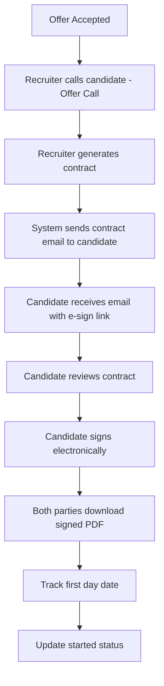

# Hired Stage Functionality Audit 🔍
**Date:** January 9, 2026  
**Context:** Post-client negotiation → All accepted → Hired status  
**Focus:** Contract sending, E-signature, Offer calls

---

## 📍 Current Status: What EXISTS

### ✅ 1. **View Contract Functionality** - FULLY BUILT

**Route:** `/recruiter/contracts/[applicationId]`  
**File:** `src/app/(recruiter)/recruiter/contracts/[applicationId]/page.tsx`

**What Works:**
- ✅ Beautiful contract view page with full DOLE compliance
- ✅ Shows all employment terms, compensation, benefits
- ✅ Displays signature status (signed/pending)
- ✅ E-signature integration (certificate ID, document hash, IP address)
- ✅ Download PDF button (UI ready, functionality pending)
- ✅ Accessible from Placements page via "View Contract" button

**Button Integration:**
```tsx
// In placements/page.tsx (line 459-464)
<Link href={`/recruiter/contracts/${placement.applicationId}`}>
  <Button size="sm" variant="outline">
    <FileText className="h-4 w-4 mr-1" />
    View Contract
  </Button>
</Link>
```

---

### ✅ 2. **E-Signature System** - FULLY FUNCTIONAL

**API Endpoint:** `/api/offers/[offerId]/sign`  
**File:** `src/app/api/offers/[offerId]/sign/route.ts`

**Legal Compliance:**
- ✅ R.A. 8792 (E-Commerce Act) compliant
- ✅ Document hash generation (SHA-256)
- ✅ IP address capture
- ✅ Device type detection
- ✅ Certificate ID for verification
- ✅ Timestamp and signatory name storage
- ✅ Audit trail complete

**Component:** `ESignatureCapture.tsx`
- ✅ Full name entry
- ✅ Terms agreement checkbox
- ✅ Click-to-sign functionality
- ✅ Signature confirmation display

---

### ✅ 3. **Offer Call Functionality** - AVAILABLE

**Call Type:** `recruiter_offer`  
**Integration:** VideoCallButton component with `context="offers"`

**Configuration:**
```typescript
// From VideoCallButton.tsx (line 66-74)
{
  value: 'recruiter_offer',
  label: 'Offer Call',
  icon: Award,
  description: 'Discuss/present offer',
  color: 'text-amber-400',
  bgColor: 'bg-amber-500/10',
  category: 'recruiter',
}

// Context mapping (line 138)
offers: ['recruiter_offer', 'recruiter_general']
```

**Features:**
- ✅ Video/audio call capability
- ✅ Recording enabled
- ✅ Transcription enabled
- ✅ Call artifacts stored
- ✅ Call history tracked

---

### ✅ 4. **Hired Status Tracking Component**

**Component:** `HiredStatus.tsx`  
**File:** `src/components/shared/application/HiredStatus.tsx`

**Tracks:**
- ✅ Offer acceptance date
- ✅ Contract signed status
- ✅ First day date
- ✅ Started status (hired/started/no_show)
- ✅ Editable fields for recruiters
- ✅ API endpoint: `/api/recruiter/applications/[id]/hired`

---

## ❌ What's MISSING at Hired Stage

### 🚫 1. **NO "Send Contract with E-Sign" Button**

**Gap:** There's NO UI button or API to send the contract with e-signature to the candidate

**What Should Exist:**
```typescript
// MISSING: API endpoint
POST /api/recruiter/contracts/send
Body: {
  applicationId: string,
  contractId: string,
  candidateEmail: string,
  sendNotification: boolean
}

// Should trigger:
// 1. Generate contract PDF
// 2. Send email to candidate with e-sign link
// 3. Create notification
// 4. Update contract status to 'sent'
```

**Where It Should Be:**
- **Option A:** In `/recruiter/placements/[id]` detail page
- **Option B:** After offer acceptance in `/recruiter/applications/[id]`
- **Option C:** In `/recruiter/offers/[id]` when status = 'accepted'

---

### 🚫 2. **NO Offer Call Button at Placements/Hired Stage**

**Gap:** VideoCallButton with `context="offers"` is NOT integrated in placements

**Current State:**
- ✅ Offer calls work in `/recruiter/offers` page
- ❌ NOT available in `/recruiter/placements` page
- ❌ NOT available in `/recruiter/applications/[id]` when hired

**What Should Exist:**
```tsx
// MISSING: In placements page or hired application detail
<VideoCallButton
  candidateUserId={placement.candidateId}
  candidateName={placement.candidateName}
  candidateEmail={placement.candidateEmail}
  candidateAvatar={placement.candidateAvatar}
  jobId={placement.jobId}
  jobTitle={placement.jobTitle}
  applicationId={placement.applicationId}
  context="offers"  // This limits to recruiter_offer + general
  variant="default"
  className="w-full"
/>
```

---

### 🚫 3. **NO Contract Generation API**

**Gap:** Contracts can be VIEWED but not GENERATED on-demand

**What Should Exist:**
```typescript
// MISSING: API endpoint
POST /api/recruiter/contracts/generate
Body: {
  applicationId: string,
  offerId: string,
  employerDetails: {...},
  employeeDetails: {...},
  terms: {...}
}

Response: {
  contractId: string,
  contractUrl: string, // View URL
  pdfUrl: string,      // PDF download URL
  status: 'draft' | 'generated' | 'sent' | 'signed'
}
```

---

### 🚫 4. **NO Email Notification for Contract Signing**

**Gap:** When contract is generated, candidate doesn't get an email

**What Should Exist:**
- Email template: "Your Employment Contract is Ready for Signature"
- Link to contract view page with e-sign component
- Reminder emails if not signed after 3 days
- Confirmation email after signing

---

### 🚫 5. **NO Contract PDF Download**

**Current State:**
```tsx
// Line 228-233 in contracts/[applicationId]/page.tsx
<Button
  className="bg-gradient-to-r from-orange-500 to-amber-600"
  onClick={() => toast.info('PDF download coming soon!')}
>
  <Download className="w-4 w-4 mr-2" />
  Download PDF
</Button>
```

**Gap:** Button shows "PDF download coming soon!" - not implemented

**What Should Exist:**
```typescript
// API endpoint
GET /api/contracts/[contractId]/download
Response: PDF file stream
```

---

## 🔄 Complete Hired Stage Flow (As It Should Be)

### **Flow from "Offer Accepted" → "Candidate Started":**



### **Current Gaps in Flow:**

| Step | Status | Missing |
|------|--------|---------|
| Offer Accepted | ✅ Works | - |
| **Recruiter Offer Call** | ⚠️ Partial | NOT integrated in placements/hired detail |
| **Generate Contract** | ❌ Missing | No API to generate contract |
| **Send Contract Email** | ❌ Missing | No send functionality |
| Candidate receives email | ❌ Missing | No email template |
| Candidate reviews contract | ✅ Works | Contract view page exists |
| **Candidate signs** | ✅ Works | E-signature fully functional |
| **Download signed PDF** | ❌ Missing | Button placeholder only |
| Track first day | ✅ Works | HiredStatus component |
| Update started status | ✅ Works | HiredStatus component |

---

## 🎯 What NEEDS to Be Built

### Priority 1: Contract Sending System

**1. Contract Generation API**
```typescript
// File: src/app/api/recruiter/contracts/generate/route.ts
POST /api/recruiter/contracts/generate
- Generate contract from offer data
- Create contract record in database
- Return contract ID and view URL
```

**2. Contract Send API**
```typescript
// File: src/app/api/recruiter/contracts/send/route.ts
POST /api/recruiter/contracts/send
- Send email to candidate with e-sign link
- Create notification
- Update contract status to 'sent'
- Schedule reminder emails
```

**3. UI Button in Placements**
```tsx
// Add to: src/app/(recruiter)/recruiter/placements/page.tsx
// OR: src/app/(recruiter)/recruiter/applications/[id]/page.tsx when hired

<Button
  onClick={() => handleSendContract(placement.applicationId)}
  className="bg-gradient-to-r from-purple-500 to-pink-600"
>
  <FileSignature className="h-4 w-4 mr-2" />
  Send Contract for E-Signature
</Button>
```

---

### Priority 2: Offer Call Integration

**Add VideoCallButton to Placements:**
```tsx
// In placements detail page or hired applications
<VideoCallButton
  candidateUserId={placement.candidateId}
  candidateName={placement.candidateName}
  candidateEmail={placement.candidateEmail}
  candidateAvatar={placement.candidateAvatar}
  jobId={placement.jobId}
  jobTitle={placement.jobTitle}
  applicationId={placement.applicationId}
  context="offers"
  variant="default"
/>
```

**Where to Add:**
- `/recruiter/placements/[id]` detail page (create if doesn't exist)
- `/recruiter/applications/[id]` when status = 'hired' or 'offer_sent'
- `/recruiter/offers/[id]` detail page

---

### Priority 3: PDF Download

**Contract PDF Generation API:**
```typescript
// File: src/app/api/contracts/[contractId]/pdf/route.ts
GET /api/contracts/[contractId]/pdf
- Generate PDF from contract data
- Include signatures and certificate
- Return PDF stream
```

**Library Suggestion:**
- Use `@react-pdf/renderer` or `puppeteer` for PDF generation
- Template should match contract view page styling

---

### Priority 4: Email Notifications

**Email Templates Needed:**
1. **Contract Ready for Signature**
   - Subject: "Your Employment Contract is Ready - Action Required"
   - Body: Link to contract view + e-sign page
   - CTA: "Review and Sign Contract"

2. **Contract Signed Confirmation**
   - Subject: "Contract Signed Successfully"
   - Body: Download link for signed PDF
   - Next steps: First day preparation

3. **Reminder Email (if not signed after 3 days)**
   - Subject: "Reminder: Please Sign Your Employment Contract"
   - Body: Link to contract + urgency message

---

## 📊 Feature Completion Matrix

| Feature | API | UI | Integration | Email | Status |
|---------|-----|----|--------------| ------|--------|
| View Contract | ✅ | ✅ | ✅ | - | **COMPLETE** |
| E-Signature | ✅ | ✅ | ✅ | - | **COMPLETE** |
| Offer Call (general) | ✅ | ✅ | ⚠️ | - | **PARTIAL** |
| **Generate Contract** | ❌ | ❌ | ❌ | - | **MISSING** |
| **Send Contract** | ❌ | ❌ | ❌ | ❌ | **MISSING** |
| **Download PDF** | ❌ | ⚠️ | - | - | **MISSING** |
| **Email Notifications** | ❌ | - | - | ❌ | **MISSING** |
| Hired Status Tracking | ✅ | ✅ | ✅ | - | **COMPLETE** |

**Legend:**
- ✅ Complete
- ⚠️ Partially implemented
- ❌ Not implemented

---

## 🔧 Recommended Implementation Order

### Phase 1: Contract Sending (Highest Priority)
1. Build contract generation API
2. Build contract send API
3. Add "Send Contract" button to placements/hired apps
4. Create email templates
5. Test end-to-end flow

### Phase 2: Offer Call Integration
1. Add VideoCallButton to placements detail page
2. Add VideoCallButton to hired applications
3. Update context to show "Offer Call" option

### Phase 3: PDF Download
1. Set up PDF generation library
2. Create PDF template matching contract view
3. Build download API endpoint
4. Connect download button

### Phase 4: Email Automation
1. Set up email service (Resend, SendGrid, etc.)
2. Create email templates
3. Add email triggers to contract APIs
4. Set up reminder scheduler

---

## 💡 Quick Wins

**Can be implemented TODAY:**

1. **Add Offer Call Button to Placements** (15 minutes)
   - Just add `<VideoCallButton context="offers" />` to placements page
   - No API changes needed

2. **Add "Send Contract" Button UI** (30 minutes)
   - Add button that shows toast for now
   - Prepare UI for when API is ready

3. **Contract Status Field** (15 minutes)
   - Add `contract_status` field to database if missing
   - Track: draft, sent, signed, downloaded

---

## 📝 Notes

**Existing Integrations Working:**
- ✅ Offer acceptance flow
- ✅ Counter offer negotiation
- ✅ E-signature capture
- ✅ Contract viewing
- ✅ Hired status tracking
- ✅ Onboarding task management

**Docs to Reference:**
- `Docs/status-reports/CONTRACT_SYSTEM_COMPLETE.md`
- `Docs/Features/PHILIPPINE_ESIGNATURE_LEGAL_GUIDE.md`
- `Docs/status-reports/RECRUITER_INTEGRATION_COMPLETE.md`

---

## 🎬 Next Steps

1. **Review this audit with the team**
2. **Prioritize which features to build first**
3. **Create tasks for missing APIs**
4. **Design email templates**
5. **Test the complete hired flow end-to-end**

---

**Status:** 🟡 **70% Complete** - Core viewing/signing works, but sending/automation is missing

